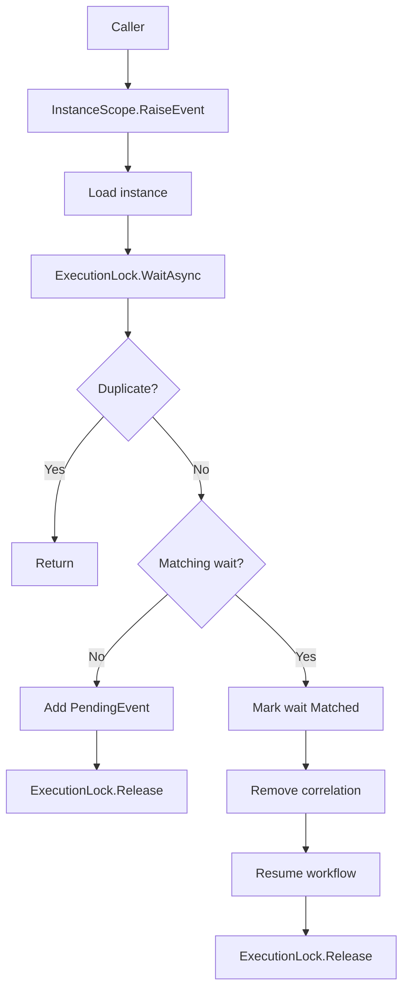
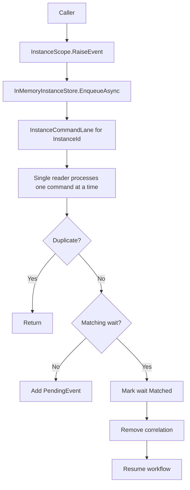
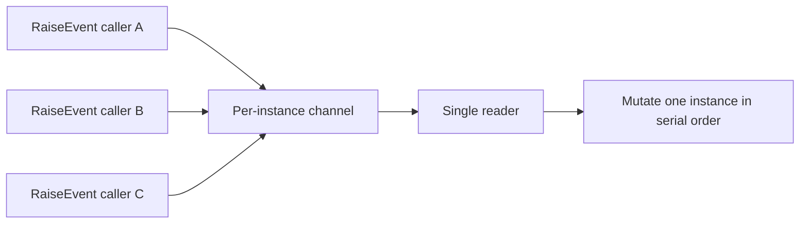
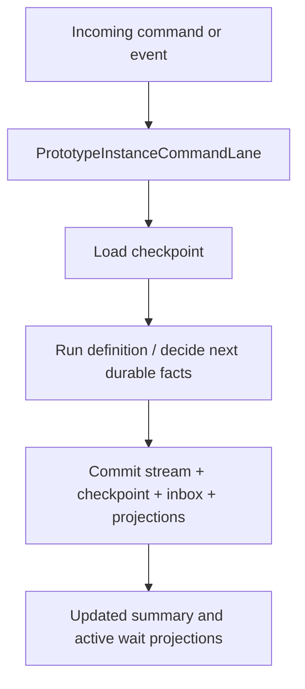
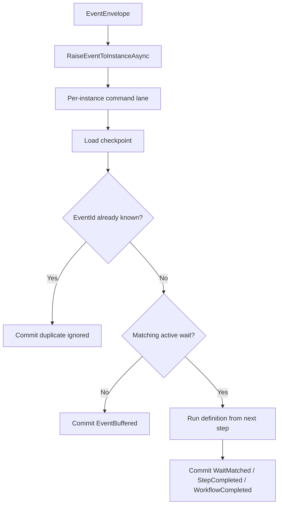
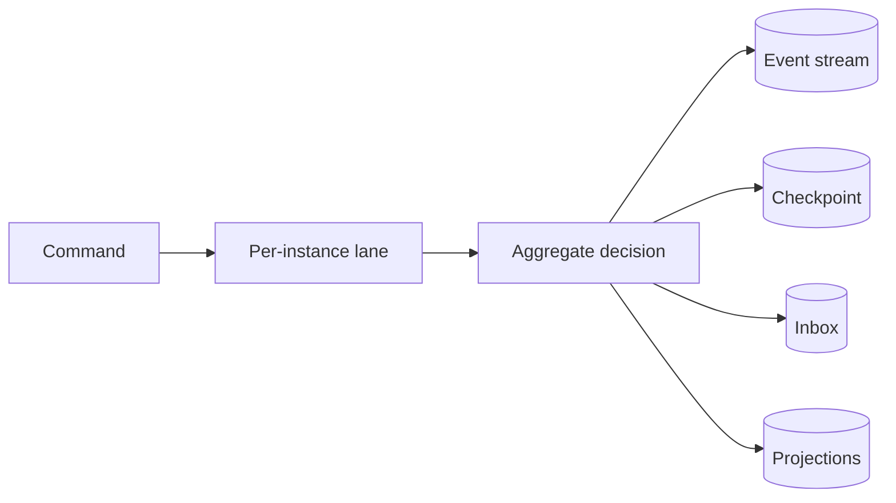
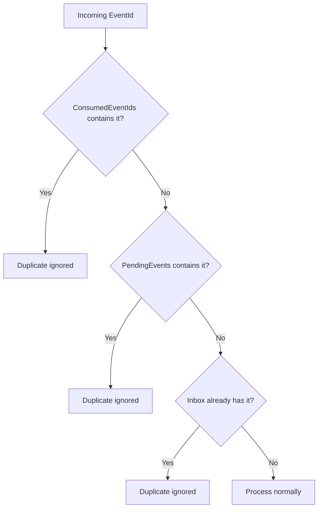
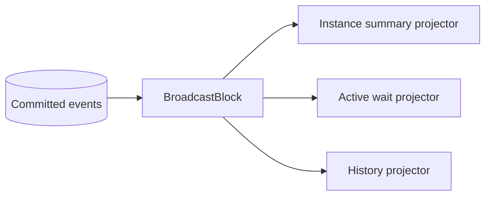
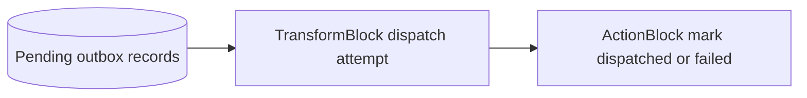

# Channels And Engine Flow Diagrams

Reviewed on March 30, 2026.

## Purpose

This document explains how per-instance channels are used in:

- the current snapshot-based engine
- the event-driven prototype

It also shows where `TPL Dataflow` could fit later.

## 1. Current Engine Before Per-Instance Channels

## 2. Current Engine After Per-Instance Channels

Key point:

- dedup did not disappear
- serialization moved earlier
- the channel is now the first in-memory gate for same-instance work

## 3. Why Channels Help The Current Engine

Benefits:

- simpler in-process concurrency model
- less direct contention on mutation code
- fewer races around direct concurrent entry

Non-goals:

- channels do not replace runtime dedup
- channels do not replace durable correctness

## 4. Event-Driven Prototype Flow

## 5. Event-Driven Prototype Resume Path

## 6. Prototype Durable Truth Boundary

The important rule is:

- the channel is not durable truth
- the store is durable truth

## 7. Dedup In The Event-Driven Prototype

## 8. Where `System.Threading.Channels` Fits Well

Good fit:

- per-instance command mailbox
- engine ingress queue
- outbox dispatch queue
- timer wake-up queue

Bad fit:

- durable event store
- durable inbox/outbox storage
- query source of truth

## 9. Where `TPL Dataflow` Fits Later

`TPL Dataflow` is not needed in the core yet, but it fits if the system grows into real asynchronous pipelines.

Good later candidates:

- outbox dispatch pipeline
- projection update fanout
- projection rebuild pipeline
- timer processing pipeline

Example future shape:

Or for outbox:

## 10. Practical Recommendation

Use:

- `System.Threading.Channels` for in-process serialized command lanes
- `TPL Dataflow` only when you truly have a multi-stage pipeline

Do not:

- build the core engine around Rx or Dataflow first
- confuse in-memory queueing with durable truth

The current state of the project matches that recommendation:

- channels are now useful in the current engine and the prototype
- Dataflow remains an optional later optimization for projection/outbox/timer pipelines
