# Engine runtime diagrams

This document illustrates how the **in-memory event-driven** runtime (`WorkflowEngine`), the **durable** runtime (`DurableWorkflowEngine`), and the **event-driven prototype** (`EventDrivenWorkflowEngine`) relate to storage, routing, and execution.

Sources of truth in code:

- `OrcaCore.Runtime/Engine/WorkflowEngine.cs`, `Querying/InstanceScope.cs`, `Execution/WorkflowRuntime.cs`
- `OrcaCore.Runtime/Durable/Engine/DurableWorkflowEngine.cs`, `Durable/Routing/DurableEventRouter.cs`, `Durable/Outbox/DurableOutboxPump.cs`
- `OrcaCore.EventDrivenPrototype/Engine/EventDrivenWorkflowEngine.cs`

---

## 1. Three engines at a glance

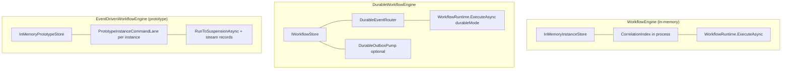

All three ultimately advance a `WorkflowInstance` by running nodes until completion, suspension on `WaitForEvent`, or failure. The durable path persists each transition; the prototype records an append-only style stream per commit.

---

## 2. In-memory engine — components

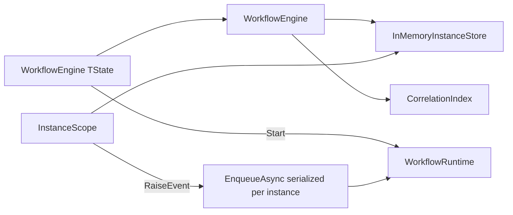

---

## 3. In-memory — starting a workflow

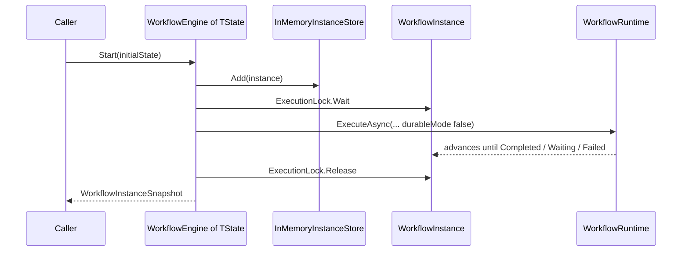

---

## 4. In-memory — raising an event to one instance

`WorkflowEngine.RaiseEvent` resolves the instance via `(EventName, CorrelationId)` on the in-memory correlation index, then `InstanceScope.RaiseEvent` runs the handler under the instance command queue.

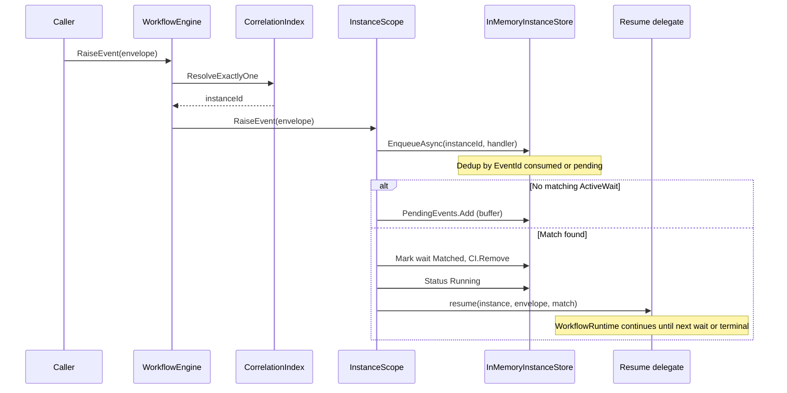

---

## 5. Durable engine — components

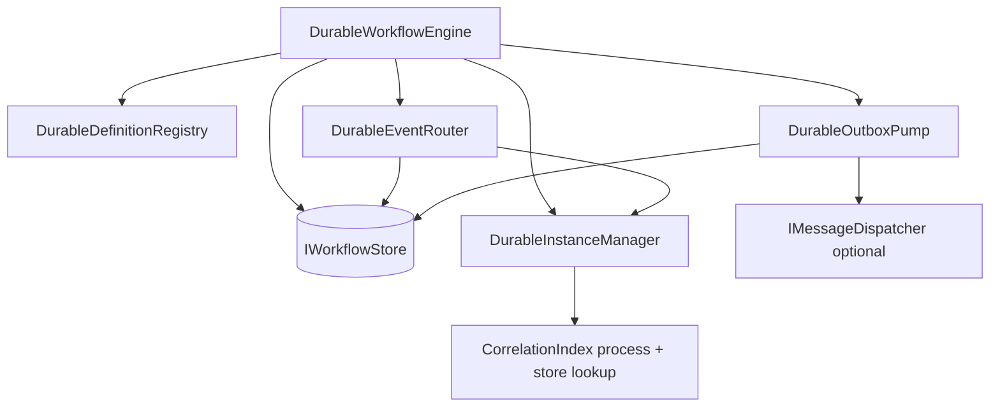

---

## 6. Durable — starting a workflow (persisted commit)

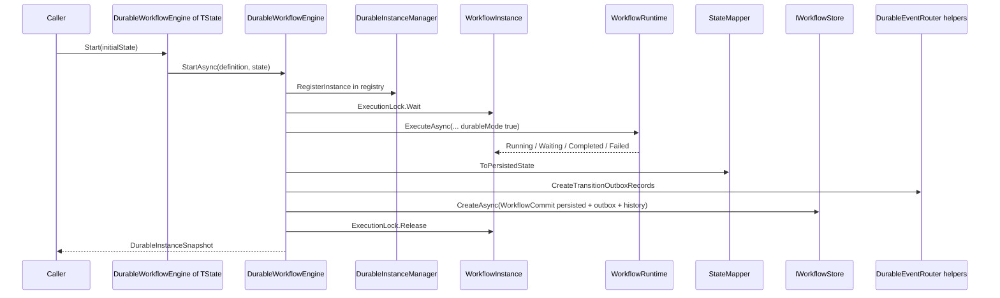

---

## 7. Durable — correlation routing and per-instance raise

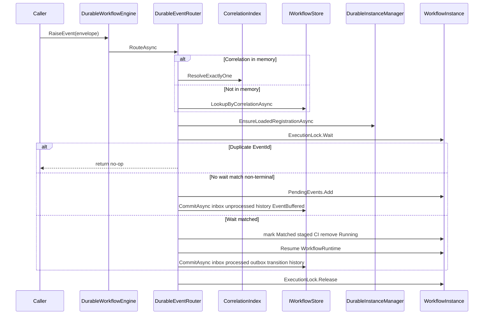

---

## 8. Durable — transactional outbox dispatch (optional)

When `AutoDispatchOutbox` is enabled with an `IMessageDispatcher`, the pump leases pending rows, dispatches, then completes or fails them in the store.

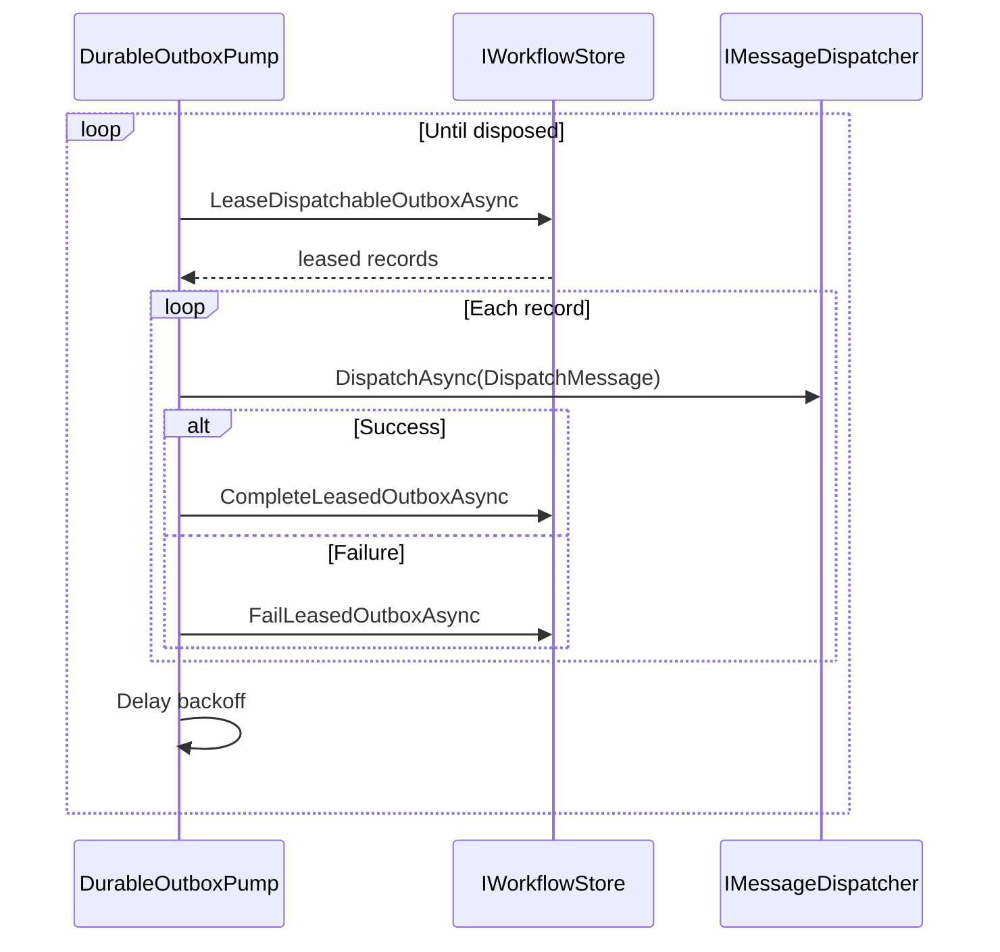

---

## 9. Event-driven prototype — components

The prototype uses a **per-instance command lane** (serialized commands) and commits **checkpoint state** plus **stream records** and **inbox rows** on each transition.

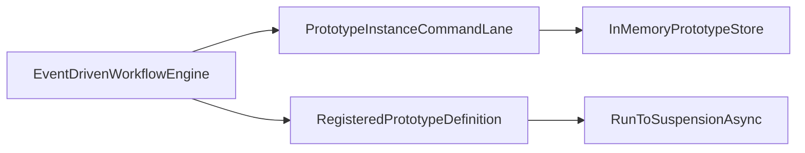

---

## 10. Event-driven prototype — start and raise (simplified)

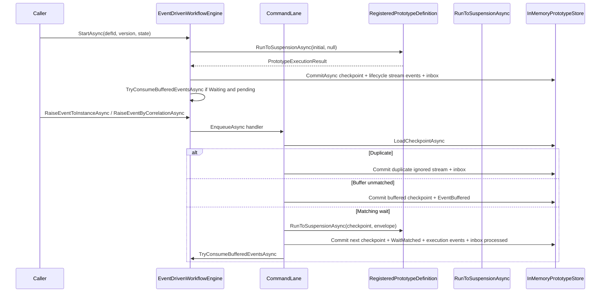

---

## 11. Execution loop (shared concept)

Both production engines delegate stepping to `WorkflowRuntime`: business steps run until `StepResult.Completed`, `Failed`, or `WaitForEvent` (suspends with active waits and correlation registration). Durable mode affects how correlation and buffering interact with persistence (durable commits after each start or event-driven transition).

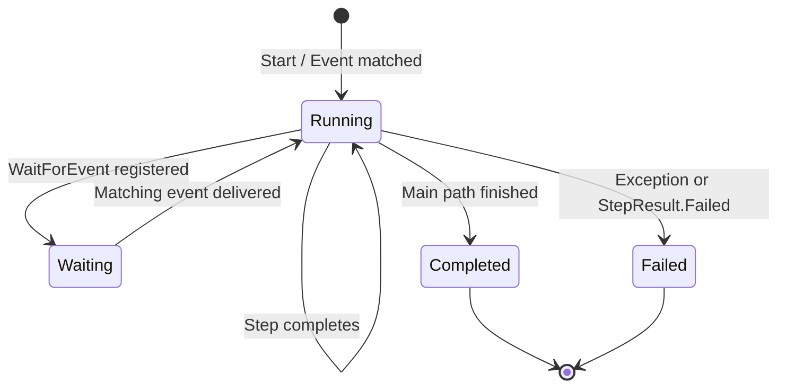

---

## How to read these alongside deeper design docs

- Outbox and provider ports: `docs/architecture/event-driven-outbox-design.md`, `docs/architecture/provider-ports-for-outbox-design.md`
- Durable inbox buffering and idempotency mirror the in-memory `InstanceScope` behavior but add `IWorkflowStore` commits and inbox records.
