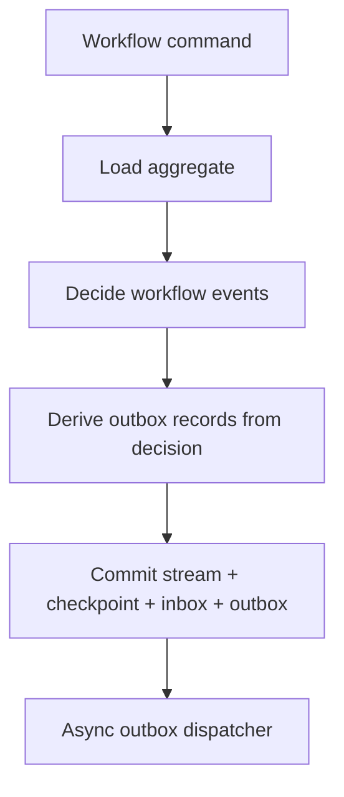

# Event-Driven Outbox Design

Reviewed on April 10, 2026.

## Purpose

This document proposes the outbox design for OrcaCore's event-driven engine.

It is written with explicit consideration for:

- event-driven durable workflow execution
- dynamic `ForEach` / fanout scenarios
- child workflow orchestration
- intermediate status publication
- the proposed monadic primitives:
  - `Result<T>`
  - `Option<T>`
  - `Validation<T>`

## Short Position

For the event-driven engine, outbox is not optional infrastructure.

It is a first-class correctness boundary.

Outbox is a durable-engine concern only. The ephemeral engine's lightweight `ForEach` does not have or need an outbox.

The write path must be able to say:

- these workflow facts were committed
- these outgoing messages were derived from those facts
- these outgoing messages will eventually be dispatched

Without that, service-bus orchestration, child workflow orchestration, and fanout status publication are not trustworthy enough.

## Why This Matters

The event-driven engine aims to support:

- durable workflow facts
- command/event coordination
- microservice orchestration
- child workflows
- dynamic fanout
- saga-friendly semantics

In all of those, a committed workflow transition often needs to publish:

- command to another service
- event to a bus
- child workflow start request
- child status message
- parent status message

If those publications are not tied to durable commit, the engine can produce inconsistent behavior:

- workflow state committed, message lost
- workflow state not committed, message published
- child appears started in parent state but no child command was published
- `ForEach` parent says “batch 7 scheduled” but batch 7 never actually leaves the process

So outbox is a required part of the event-driven design.

## Design Principles

### 1. Workflow facts first

The durable source of truth remains:

- committed workflow events

Outbox records are derived durable facts associated with those committed workflow events.

### 2. Same commit boundary

Within one accepted mutation, the following should be persisted together:

- workflow events
- checkpoint update
- inbox changes
- projection updates or projection work scheduling
- outbox records

This is the core guarantee.

### 3. Async dispatch after commit

Actual message delivery is not in the same transaction as workflow commit.

Delivery happens later:

- asynchronously
- retryably
- at-least-once

### 4. Outbox belongs to the engine, not to business steps

Business steps may request publication intent, but the runtime owns:

- final durable outbox record creation
- dispatch lifecycle
- poison handling
- idempotent dispatch semantics

## Outbox Conceptual Model

### Durable write path



### Core rule

The engine never dispatches a message that has not first been committed as an outbox record.

## What Produces Outbox Records

Outbox records may come from:

### A. Workflow decision layer

Examples:

- publish `PriceUpdated`
- send `ReserveInventory`
- emit `WorkflowStepCompleted`
- emit `ChildWorkflowStartRequested`
- emit `ChildWorkflowCancelRequested`

### B. Engine-owned status publication

Examples:

- intermediate workflow status after each step
- child-group progress updates
- child workflow completion notifications
- fanout batch progress notifications
- parent resume notifications keyed by durable resume token

### C. Parent-child orchestration

Examples:

- start child workflow command
- cancel child workflow command
- child completion event for parent
- fanout-group status updates

### D. Durable-only extension points

Examples:

- saga compensation command
- domain-specific transport message registered through durable-only outbox mapping

## Outbox Record Shape

Suggested durable model:

```csharp
public sealed record OutboxPayload(
    ReadOnlyMemory<byte> Body,
    string ContentType,
    string SchemaId);

public sealed record OutboxRecord(
    string OutboxId,
    string IdempotencyKey,
    string InstanceId,
    string? ParentInstanceId,
    string RootInstanceId,
    string StreamId,
    int StreamVersion,
    int Sequence,
    string MessageType,
    string Channel,
    string Destination,
    OutboxPayload Payload,
    string? CorrelationId,
    string? CausationEventId,
    string? ResumeTokenId,
    OutboxStatus Status,
    int AttemptCount,
    DateTimeOffset CreatedAt,
    DateTimeOffset? LastAttemptAt,
    string? LastError,
    bool Poisoned);
```

Status:

```csharp
public enum OutboxStatus
{
    Pending,
    Dispatched,
    Failed,
    Poisoned
}
```

Important fields:

- `OutboxId`
  - deterministic identifier derived from `(InstanceId, StreamVersion, Sequence)`
  - replay of the same accepted decision must recreate the same id
  - the store must upsert by this key so restart replay does not create duplicates

- `IdempotencyKey`
  - defaults to `OutboxId`
  - is the transport-visible dedupe token used by downstream consumers
  - adapters may copy it into transport-specific headers, but should not invent a new semantic key

- `StreamVersion`
  - ties the message to committed workflow progression

- `Sequence`
  - preserves intra-commit ordering for one workflow instance
  - lets dispatcher emit residual cancel commands before parent resume when both are created in one commit

- `CausationEventId`
  - explains which workflow event caused publication

- `CorrelationId`
  - for downstream tracing and orchestration

- `ResumeTokenId`
  - present on records that represent parent resume or other barrier-release messages
  - must be reused on replay rather than minting a second token

- `Payload`
  - serialized durable envelope, not a live CLR object
  - must obey the same serializer contract as durable workflow payloads and saga compensation payloads

## Deterministic Identity And Dedupe

Outbox identity must be deterministic across replay.

Rule:

- `OutboxId` is a derived composite key from `(InstanceId, StreamVersion, Sequence)`
- one valid representation is `{InstanceId}:{StreamVersion}:{Sequence}`
- stores may represent it as a composite primary key or canonical string, but should not add non-deterministic key generation
- `Sequence` is a gap-free 0-based integer assigned in `WorkflowDecision.OutgoingMessages` order
- `Sequence` is unique within `(InstanceId, StreamVersion)` and has no global meaning
- replay of the same accepted mutation must assign the same `Sequence` values in the same order
- persistence must treat `OutboxId` as an idempotent insert/upsert key

Default rule:

- `IdempotencyKey = OutboxId`

That single key serves two purposes:

- store-level duplicate suppression during replay
- transport-level duplicate suppression for at-least-once dispatch

## Outbox And Workflow Decisions

The aggregate/decision layer should not directly publish.

Instead it should return a decision object that may include:

```csharp
public sealed record WorkflowDecision(
    IReadOnlyList<WorkflowEvent> Events,
    IReadOnlyList<OutgoingMessageIntent> OutgoingMessages);
```

Where:

```csharp
public sealed record OutgoingMessageIntent(
    string MessageType,
    string Channel,
    string Destination,
    OutboxPayload Payload,
    string? CorrelationId);
```

Then the engine maps:

- `WorkflowDecision`
to
- workflow events + outbox records

This keeps side effects explicit and runtime-owned.

## Child Workflow Integration

Child workflows are a major reason outbox must exist.

### Parent starting children

When parent decides to start children, it should not directly invoke them in a distributed mode.

Instead:

1. parent commits:
   - `ChildGroupCreated`
   - `ChildScheduled`
   - outbox records `ChildWorkflowStartRequested` only for the initial dispatch window
2. outbox dispatcher delivers the start message
3. child engine receives it and starts child workflow

This gives:

- durable parent truth
- reliable child start intent
- retryable start dispatch
- restart-safe `MaxConcurrency`
- deterministic replay because the same child-start intent recreates the same `OutboxId`

### Child completion back to parent

Child completion should also go through a reliable channel:

1. child commits:
   - `ChildWorkflowCompleted`
   - outbox record `ChildWorkflowCompletedNotification`
2. dispatcher publishes notification
3. parent inbox records the notification idempotently and advances group state in the same commit
4. if the barrier is satisfied, that same parent commit records `ResumeTokenId` and enqueues parent resume publication

### Why this matters

Without outbox:

- parent may think child was scheduled, but start command was lost
- child may complete, but parent notification is lost
- `WhenAll` on child workflows becomes unreliable

## Inbox Coupling

Outbox guarantees are only half of the durable loop. Child-to-parent completion needs inbox rules as well.

Minimum inbox contract:

- every inbound message carries a dedupe key derived from the sender's `IdempotencyKey`
- parent inbox persists receipt, dedupe decision, workflow events, projection work, and any newly created outbox records in one commit
- duplicate child completion notifications do not advance the barrier twice
- when barrier completion wins, the recorded `ResumeTokenId` is reused on replay and on repeated inbox delivery

This document does not fully design inbox storage, but the outbox implementation must depend on a sibling inbox contract with those guarantees.

Detailed inbox design should live in `event-driven-inbox-design.md`.

## `ForEach` / Fanout Integration

Outbox is equally important for runtime fanout.

### Case 1: `ForEach` with external work

Example:

- parent gets 100 ids
- runtime batch size is 10
- parent creates 10 fanout items
- each fanout item publishes a command to external service

Correct path:

1. parent commits:
   - `FanoutGroupCreated`
   - `FanoutItemScheduled` x 10
   - outbox records `PriceBatchRequested` x 10
2. dispatcher sends them
3. completion events come back
4. parent joins on durable fanout state

### Case 2: `ForEach` with child workflows

Example:

- parent partitions ids into runtime batches
- each batch becomes a child workflow

Correct path:

1. parent commits:
   - `ChildGroupCreated`
   - `ChildScheduled` per batch
   - outbox start requests only for the initial window allowed by `MaxConcurrency`
2. dispatcher sends the initial child start requests
3. child completions come back through outbox-backed notifications
4. each completion commit may enqueue the next child start request until `NextDispatchIndex` reaches the end

### Intermediate status publication

Fanout and child orchestration often need:

- per-item status
- per-batch status
- per-step status
- aggregate progress

These should also be published through outbox rather than emitted directly.

## Monadic Design Integration

The proposed monadic primitives improve the outbox design.

### `Validation<T>`

Use for:

- validating outbox mapping configuration
- validating message contract registration
- validating `ForEach`/child workflow publish policy

Examples:

- invalid destination
- missing serializer mapping
- illegal policy combination

### `Option<T>`

Use for:

- optional outbox mapping result
- optional previous dispatch attempt metadata
- optional poison handler
- optional parent-child correlation

Examples:

```csharp
Option<OutboxMapping> TryResolveOutboxMapping(...);
Option<OutboxRecord> TryLoadPendingRecord(...);
```

### `Result<T>`

This is the main one.

Good fit:

- decision to outbox translation
- outbox record creation
- dispatch attempt result
- poison classification

Examples:

```csharp
Result<IReadOnlyList<OutboxRecord>> CreateOutboxRecords(WorkflowDecision decision);
Result<DispatchOutcome> Dispatch(DispatchMessage message);
Result<PoisonDecision> EvaluatePoison(OutboxRecord record, Exception error);
```

This keeps outbox behavior explicit without leaning on exceptions for ordinary dispatch outcomes.

## Dispatcher Design

Dispatcher should be decoupled from commit.

In the durable runtime, persistence stays on `OutboxRecord`, but the transport-facing port operates on a shared envelope so ephemeral and durable hosts can share broker adapters.

Implemented abstraction (see `OrcaCore.Abstractions.Messaging`):

```csharp
public interface IMessageDispatcher
{
    Task<Result<DispatchOutcome>> DispatchAsync(
        DispatchMessage message,
        CancellationToken cancellationToken);
}
```

`DispatchMessage` carries `MessageId`, `IdempotencyKey`, routing (`Channel`, `Destination`), `DispatchPayload` (bytes, content type, schema id), correlation/lineage fields, and optional `Headers`. The durable outbox pump maps each leased `OutboxRecord` to `DispatchMessage` before invoking the dispatcher.

Where:

```csharp
public sealed record DispatchOutcome(
    bool Succeeded,
    bool Retryable,
    string? Error);
```

### Dispatcher responsibilities

- publish to transport
- report success/failure
- preserve persisted `Sequence` ordering for records belonging to the same `InstanceId`
- serialize dispatch eligibility per `InstanceId`, while allowing different `InstanceId` values to dispatch in parallel
- do not mutate workflow state directly

### Engine responsibilities

- load pending records
- call dispatcher
- mark dispatched / failed / poisoned
- retry according to policy

### Ordering rule

Outbox records created by one accepted mutation are not an unordered set.

Required rule:

- records for the same `InstanceId` dispatch in persisted `Sequence` order
- a record is not eligible for dispatch until all lower-`Sequence` records for the same `InstanceId` are in a terminal status
- a failing record therefore head-of-line-blocks its instance until it succeeds or is poisoned
- when one commit contains both residual child-cancel commands and parent resume publication, the engine's decision-to-records mapping must assign lower `Sequence` values to the cancel commands than to resume
- the dispatcher preserves the order produced by the mapping layer; it does not repair incorrect ordering after persistence
- cross-instance ordering is not required

## Retry And Poison Policy

Outbox is at-least-once.

So the design must explicitly define:

- retry behavior
- poison threshold
- poison handling

Suggested policy model:

```csharp
public sealed record OutboxRetryPolicy(
    int MaxAttempts,
    TimeSpan InitialDelay,
    double BackoffFactor,
    TimeSpan MaxDelay);
```

Poison handling:

```csharp
public interface IOutboxPoisonHandler
{
    Task HandleAsync(
        OutboxRecord record,
        Exception exception,
        CancellationToken cancellationToken);
}
```

For child workflows and fanout:

- poison must be visible operationally
- parent workflows may need stuck-child or failed-dispatch remediation paths later

Current scope:

- poisoned child-start or child-cancel records must be observable on the outbox projection
- automatic parent advancement on poison remains out of scope for this iteration

## Projection Interaction

Projections should not depend on successful external dispatch.

That means:

- workflow and fanout/child state projections update on commit
- outbox projection tracks dispatch lifecycle separately

Examples:

- parent can show `10 children scheduled`
- even if only 8 child start messages have actually been dispatched yet

That distinction is important and should be observable.

Suggested projection:

```csharp
public sealed record OutboxSummaryProjection(
    string InstanceId,
    string? GroupId,
    int PendingCount,
    int FailedCount,
    int PoisonedCount,
    int DispatchedCount,
    DateTimeOffset UpdatedAt);
```

For child orchestration, the projection should be queryable by group and message type so operators can distinguish:

- poisoned child-start commands
- poisoned child-cancel commands
- normal status publications

## Transaction Boundary

This is the most important rule in the design.

For one accepted workflow mutation, the engine must persist together:

- workflow events
- checkpoint update
- inbox updates
- outbox records
- runtime projections or projection work items

This boundary is where correctness lives.

Not included in the same transaction:

- actual external publish
- actual child service execution
- actual downstream consumer processing

Those happen later and are retried independently.

## Example Flows

### Example 1: Price update workflow

Flow:

1. timer command starts workflow cycle
2. workflow collects listing ids
3. workflow partitions ids into runtime batches
4. workflow commits:
   - `FanoutGroupCreated`
   - `FanoutItemScheduled` x N
   - outbox records `PriceBatchRequested` x N
5. dispatcher sends batch commands
6. batch completion events return
7. workflow commits:
   - `FanoutItemCompleted`
   - maybe `PriceUpdatedPublished` intents
   - outbox records for downstream `PriceUpdated`
8. parent joins when all batches complete

### Example 2: Child workflow start

Flow:

1. parent commits:
    - `ChildGroupCreated`
    - `ChildScheduled`
    - outbox `ChildWorkflowStartRequested` for the initial dispatch window only
2. dispatcher publishes
3. child starts
4. child completes and commits:
    - `ChildWorkflowCompleted`
    - outbox `ChildWorkflowCompletedNotification`
5. parent inbox dedupes completion, updates group state, and records `ResumeTokenId` if the barrier is satisfied
6. same commit enqueues ordered cancel commands first and parent resume second when `WhenAny + CancelRemaining` applies

### Example 3: Intermediate step status

Flow:

1. workflow step commits `StepCompleted`
2. same commit includes outbox `WorkflowStepStatusChanged`
3. dispatcher publishes status event later

This makes step-level status durable and retryable.

## Acceptance Criteria To Add

### OB-AT-001: Workflow commit and outbox creation are atomic

Given a workflow mutation that requires message publication
When the mutation commits
Then workflow facts and outbox records are persisted together

### OB-AT-002: External dispatch failure does not roll back committed workflow state

Given committed workflow facts and outbox records
When external dispatch fails
Then workflow state remains committed
And the outbox record remains retryable

### OB-AT-003: Parent child start intent survives restart

Given a parent workflow that schedules child workflows
When the host restarts before dispatch
Then pending child-start outbox records remain dispatchable

### OB-AT-004: Fanout command publication survives restart

Given a `ForEach` group that committed scheduled work items
When the host restarts before dispatch
Then pending fanout outbox records remain dispatchable

### OB-AT-005: Intermediate status publication is durable

Given a workflow step that publishes status
When the host crashes after commit but before dispatch
Then the status publication remains present in outbox and is eventually dispatchable

### OB-AT-006: Replay of the same decision does not create duplicate outbox records

Given a workflow decision that is replayed after a crash
When the engine recreates outbox records for that same accepted mutation
Then each recreated record has the same `OutboxId`
And persistence suppresses duplicate inserts by `OutboxId`

### OB-AT-007: Same-instance dispatch preserves commit order

Given one workflow commit that creates multiple outbox records for the same `InstanceId`
When the dispatcher processes those records
Then it dispatches them in persisted `Sequence` order
And child cancel commands dispatch before parent resume if both exist in that commit

### OB-AT-008: Durable child throttling emits only the active window

Given `RunChildren` with `MaxConcurrency = N`
When the parent first commits the child group
Then only the initial window of `min(MaxConcurrency, TotalChildren)` child-start records is created
And later child completions create additional start records as slots open

### OB-AT-009: Resume token is recorded once and reused on replay

Given a child-group barrier that becomes satisfied
When the parent records resume intent
Then the same commit persists `ResumeTokenId` before resume dispatch
And replay reuses the same token rather than minting a new one

### OB-AT-010: Inbox dedupe prevents duplicate parent advancement

Given duplicate child completion notifications caused by at-least-once delivery
When the parent processes them through inbox
Then only the first accepted notification changes group/barrier state
And later duplicates are recorded as deduped without advancing the parent again

### OB-AT-011: Outbox payloads are durable serialized envelopes

Given an outbox record for external dispatch, child orchestration, or saga compensation
When the record is persisted and later dispatched from another process
Then payload bytes, `ContentType`, and `SchemaId` are sufficient to deserialize it correctly

### OB-AT-012: Durable-only extensions reuse the same physical outbox

Given a new durable message kind such as `ChildWorkflowCancelRequested` or saga compensation
When the engine registers its outbox mapping
Then it produces standard `OutboxRecord` entries in the same physical outbox
And does not require a second outbox store

## Recommended Implementation Order

1. define outbox mapping model from workflow decision to `OutgoingMessageIntent`
2. add outbox persistence with deterministic `OutboxId`, `IdempotencyKey`, serialized payload envelope, and ordered `Sequence`
3. add sibling inbox contract for dedupe and commit coupling
4. add pending outbox query and dispatch lifecycle with same-instance ordering
5. add retry and poison policy
6. integrate with child workflow start/completion and durable resume-token handling
7. integrate with `ForEach` / fanout scheduling using incremental windowed emission for `MaxConcurrency`
8. add durable-only registration for cancellation and compensation message kinds
9. add status-message publication patterns

## Recommendation

Treat outbox as a core engine component of the event-driven design.

It should be implemented before:

- rich child workflow orchestration
- distributed `ForEach` fanout
- saga-like distributed compensation

Because all of those depend on reliable publish-after-commit behavior.
