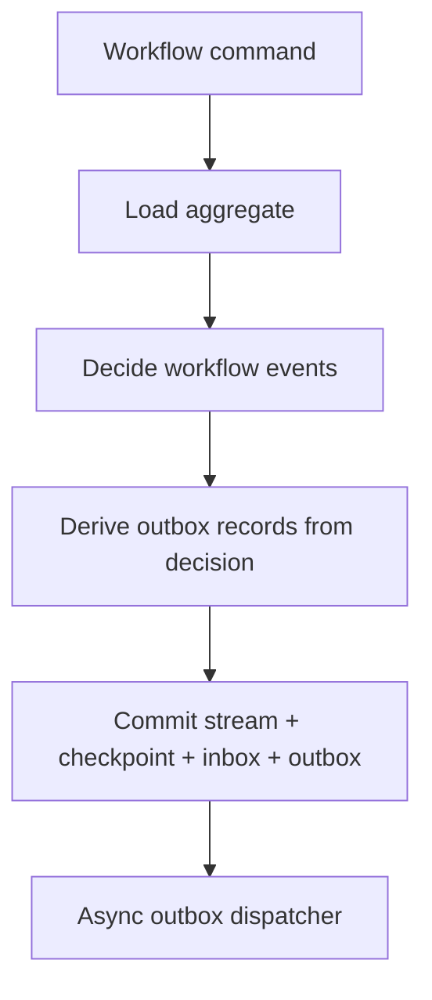

# Event-Driven Outbox Design

Reviewed on April 10, 2026.

## Purpose

This document proposes the outbox design for OrcaCore's event-driven engine.

It is written with explicit consideration for:

- event-driven durable workflow execution
- dynamic `ForEach` / fanout scenarios
- child workflow orchestration
- intermediate status publication
- the proposed monadic primitives:
  - `Result<T>`
  - `Option<T>`
  - `Validation<T>`

## Short Position

For the event-driven engine, outbox is not optional infrastructure.

It is a first-class correctness boundary.

The write path must be able to say:

- these workflow facts were committed
- these outgoing messages were derived from those facts
- these outgoing messages will eventually be dispatched

Without that, service-bus orchestration, child workflow orchestration, and fanout status publication are not trustworthy enough.

## Why This Matters

The event-driven engine aims to support:

- durable workflow facts
- command/event coordination
- microservice orchestration
- child workflows
- dynamic fanout
- saga-friendly semantics

In all of those, a committed workflow transition often needs to publish:

- command to another service
- event to a bus
- child workflow start request
- child status message
- parent status message

If those publications are not tied to durable commit, the engine can produce inconsistent behavior:

- workflow state committed, message lost
- workflow state not committed, message published
- child appears started in parent state but no child command was published
- `ForEach` parent says “batch 7 scheduled” but batch 7 never actually leaves the process

So outbox is a required part of the event-driven design.

## Design Principles

### 1. Workflow facts first

The durable source of truth remains:

- committed workflow events

Outbox records are derived durable facts associated with those committed workflow events.

### 2. Same commit boundary

Within one accepted mutation, the following should be persisted together:

- workflow events
- checkpoint update
- inbox changes
- projection updates or projection work scheduling
- outbox records

This is the core guarantee.

### 3. Async dispatch after commit

Actual message delivery is not in the same transaction as workflow commit.

Delivery happens later:

- asynchronously
- retryably
- at-least-once

### 4. Outbox belongs to the engine, not to business steps

Business steps may request publication intent, but the runtime owns:

- final durable outbox record creation
- dispatch lifecycle
- poison handling
- idempotent dispatch semantics

## Outbox Conceptual Model

### Durable write path



### Core rule

The engine never dispatches a message that has not first been committed as an outbox record.

## What Produces Outbox Records

Outbox records may come from:

### A. Workflow decision layer

Examples:

- publish `PriceUpdated`
- send `ReserveInventory`
- emit `WorkflowStepCompleted`
- emit `ChildWorkflowStartRequested`

### B. Engine-owned status publication

Examples:

- intermediate workflow status after each step
- child-group progress updates
- child workflow completion notifications
- fanout batch progress notifications

### C. Parent-child orchestration

Examples:

- start child workflow command
- child completion event for parent
- fanout-group status updates

## Outbox Record Shape

Suggested durable model:

```csharp
public sealed record OutboxRecord(
    string OutboxId,
    string InstanceId,
    string StreamId,
    int StreamVersion,
    string MessageType,
    string Channel,
    string Destination,
    object Payload,
    string? CorrelationId,
    string? CausationEventId,
    OutboxStatus Status,
    int AttemptCount,
    DateTimeOffset CreatedAt,
    DateTimeOffset? LastAttemptAt,
    string? LastError,
    bool Poisoned);
```

Status:

```csharp
public enum OutboxStatus
{
    Pending,
    Dispatched,
    Failed,
    Poisoned
}
```

Important fields:

- `StreamVersion`
  - ties the message to committed workflow progression

- `CausationEventId`
  - explains which workflow event caused publication

- `CorrelationId`
  - for downstream tracing and orchestration

## Outbox And Workflow Decisions

The aggregate/decision layer should not directly publish.

Instead it should return a decision object that may include:

```csharp
public sealed record WorkflowDecision(
    IReadOnlyList<WorkflowEvent> Events,
    IReadOnlyList<OutgoingMessageIntent> OutgoingMessages);
```

Where:

```csharp
public sealed record OutgoingMessageIntent(
    string MessageType,
    string Channel,
    string Destination,
    object Payload,
    string? CorrelationId);
```

Then the engine maps:

- `WorkflowDecision`
to
- workflow events + outbox records

This keeps side effects explicit and runtime-owned.

## Child Workflow Integration

Child workflows are a major reason outbox must exist.

### Parent starting children

When parent decides to start children, it should not directly invoke them in a distributed mode.

Instead:

1. parent commits:
   - `ChildGroupCreated`
   - `ChildScheduled`
   - outbox record `ChildWorkflowStartRequested`
2. outbox dispatcher delivers the start message
3. child engine receives it and starts child workflow

This gives:

- durable parent truth
- reliable child start intent
- retryable start dispatch

### Child completion back to parent

Child completion should also go through a reliable channel:

1. child commits:
   - `ChildWorkflowCompleted`
   - outbox record `ChildWorkflowCompletedNotification`
2. dispatcher publishes notification
3. parent receives completion event and advances group state

### Why this matters

Without outbox:

- parent may think child was scheduled, but start command was lost
- child may complete, but parent notification is lost
- `WhenAll` on child workflows becomes unreliable

## `ForEach` / Fanout Integration

Outbox is equally important for runtime fanout.

### Case 1: `ForEach` with external work

Example:

- parent gets 100 ids
- runtime batch size is 10
- parent creates 10 fanout items
- each fanout item publishes a command to external service

Correct path:

1. parent commits:
   - `FanoutGroupCreated`
   - `FanoutItemScheduled` x 10
   - outbox records `PriceBatchRequested` x 10
2. dispatcher sends them
3. completion events come back
4. parent joins on durable fanout state

### Case 2: `ForEach` with child workflows

Example:

- parent partitions ids into runtime batches
- each batch becomes a child workflow

Correct path:

1. parent commits:
   - `ChildGroupCreated`
   - `ChildScheduled` per batch
   - outbox start requests per child
2. dispatcher sends child start requests
3. child completions come back through outbox-backed notifications

### Intermediate status publication

Fanout and child orchestration often need:

- per-item status
- per-batch status
- per-step status
- aggregate progress

These should also be published through outbox rather than emitted directly.

## Monadic Design Integration

The proposed monadic primitives improve the outbox design.

### `Validation<T>`

Use for:

- validating outbox mapping configuration
- validating message contract registration
- validating `ForEach`/child workflow publish policy

Examples:

- invalid destination
- missing serializer mapping
- illegal policy combination

### `Option<T>`

Use for:

- optional outbox mapping result
- optional previous dispatch attempt metadata
- optional poison handler
- optional parent-child correlation

Examples:

```csharp
Option<OutboxMapping> TryResolveOutboxMapping(...);
Option<OutboxRecord> TryLoadPendingRecord(...);
```

### `Result<T>`

This is the main one.

Good fit:

- decision to outbox translation
- outbox record creation
- dispatch attempt result
- poison classification

Examples:

```csharp
Result<IReadOnlyList<OutboxRecord>> CreateOutboxRecords(WorkflowDecision decision);
Result<DispatchOutcome> Dispatch(OutboxRecord record);
Result<PoisonDecision> EvaluatePoison(OutboxRecord record, Exception error);
```

This keeps outbox behavior explicit without leaning on exceptions for ordinary dispatch outcomes.

## Dispatcher Design

Dispatcher should be decoupled from commit.

Suggested abstraction:

```csharp
public interface IOutboxDispatcher
{
    Task<Result<DispatchOutcome>> DispatchAsync(
        OutboxRecord record,
        CancellationToken cancellationToken);
}
```

Where:

```csharp
public sealed record DispatchOutcome(
    bool Succeeded,
    bool Retryable,
    string? Error);
```

### Dispatcher responsibilities

- publish to transport
- report success/failure
- do not mutate workflow state directly

### Engine responsibilities

- load pending records
- call dispatcher
- mark dispatched / failed / poisoned
- retry according to policy

## Retry And Poison Policy

Outbox is at-least-once.

So the design must explicitly define:

- retry behavior
- poison threshold
- poison handling

Suggested policy model:

```csharp
public sealed record OutboxRetryPolicy(
    int MaxAttempts,
    TimeSpan InitialDelay,
    double BackoffFactor,
    TimeSpan MaxDelay);
```

Poison handling:

```csharp
public interface IOutboxPoisonHandler
{
    Task HandleAsync(OutboxRecord record, CancellationToken cancellationToken);
}
```

For child workflows and fanout:

- poison must be visible operationally
- parent workflows may need stuck-child or failed-dispatch remediation paths later

## Projection Interaction

Projections should not depend on successful external dispatch.

That means:

- workflow and fanout/child state projections update on commit
- outbox projection tracks dispatch lifecycle separately

Examples:

- parent can show `10 children scheduled`
- even if only 8 child start messages have actually been dispatched yet

That distinction is important and should be observable.

Suggested projection:

```csharp
public sealed record OutboxSummaryProjection(
    string InstanceId,
    int PendingCount,
    int FailedCount,
    int PoisonedCount,
    int DispatchedCount,
    DateTimeOffset UpdatedAt);
```

## Transaction Boundary

This is the most important rule in the design.

For one accepted workflow mutation, the engine must persist together:

- workflow events
- checkpoint update
- inbox updates
- outbox records
- runtime projections or projection work items

This boundary is where correctness lives.

Not included in the same transaction:

- actual external publish
- actual child service execution
- actual downstream consumer processing

Those happen later and are retried independently.

## Example Flows

### Example 1: Price update workflow

Flow:

1. timer command starts workflow cycle
2. workflow collects listing ids
3. workflow partitions ids into runtime batches
4. workflow commits:
   - `FanoutGroupCreated`
   - `FanoutItemScheduled` x N
   - outbox records `PriceBatchRequested` x N
5. dispatcher sends batch commands
6. batch completion events return
7. workflow commits:
   - `FanoutItemCompleted`
   - maybe `PriceUpdatedPublished` intents
   - outbox records for downstream `PriceUpdated`
8. parent joins when all batches complete

### Example 2: Child workflow start

Flow:

1. parent commits:
   - `ChildGroupCreated`
   - `ChildScheduled`
   - outbox `ChildWorkflowStartRequested`
2. dispatcher publishes
3. child starts
4. child completes and commits:
   - `ChildWorkflowCompleted`
   - outbox `ChildWorkflowCompletedNotification`
5. parent receives child completion and advances

### Example 3: Intermediate step status

Flow:

1. workflow step commits `StepCompleted`
2. same commit includes outbox `WorkflowStepStatusChanged`
3. dispatcher publishes status event later

This makes step-level status durable and retryable.

## Acceptance Criteria To Add

### OB-AT-001: Workflow commit and outbox creation are atomic

Given a workflow mutation that requires message publication
When the mutation commits
Then workflow facts and outbox records are persisted together

### OB-AT-002: External dispatch failure does not roll back committed workflow state

Given committed workflow facts and outbox records
When external dispatch fails
Then workflow state remains committed
And the outbox record remains retryable

### OB-AT-003: Parent child start intent survives restart

Given a parent workflow that schedules child workflows
When the host restarts before dispatch
Then pending child-start outbox records remain dispatchable

### OB-AT-004: Fanout command publication survives restart

Given a `ForEach` group that committed scheduled work items
When the host restarts before dispatch
Then pending fanout outbox records remain dispatchable

### OB-AT-005: Intermediate status publication is durable

Given a workflow step that publishes status
When the host crashes after commit but before dispatch
Then the status publication remains present in outbox and is eventually dispatchable

## Recommended Implementation Order

1. define outbox mapping model from workflow decision to `OutgoingMessageIntent`
2. add outbox persistence to event-driven prototype store contract
3. add pending outbox query and dispatch lifecycle
4. add retry and poison policy
5. integrate with child workflow start/completion
6. integrate with `ForEach` / fanout scheduling
7. add status-message publication patterns

## Recommendation

Treat outbox as a core engine component of the event-driven design.

It should be implemented before:

- rich child workflow orchestration
- distributed `ForEach` fanout
- saga-like distributed compensation

Because all of those depend on reliable publish-after-commit behavior.
