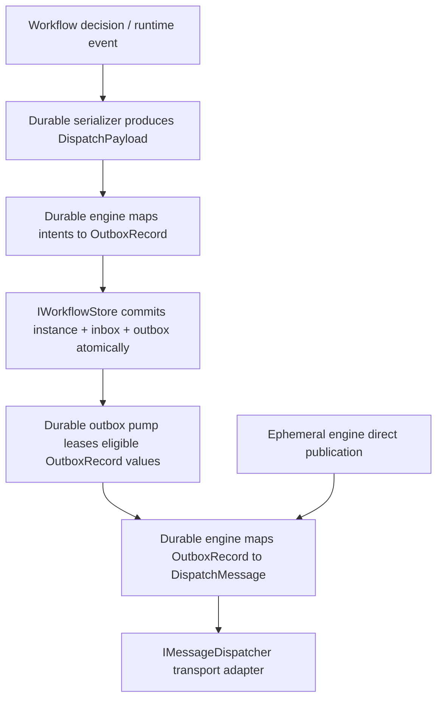

# Provider Ports For Outbox Design

Drafted on April 10, 2026.

This document tightens the provider-facing ports that must support the revised outbox design from [event-driven-outbox-design.md](event-driven-outbox-design.md).

**Implementation status (April 2026):** The reference in-memory durable path in `OrcaCore.Runtime` already follows this split: `WorkflowCommit` + claim-aware `IWorkflowStore` outbox APIs, `OutboxRecord` with deterministic ids and `SerializedPayloadEnvelope`, `JsonPayloadEnvelopeSerializer` / `IPayloadEnvelopeSerializer`, and `DurableOutboxPump` calling `IMessageDispatcher` with `DispatchMessage`. The sections below state the contract and rationale; treat `src/` as authoritative where narrative and code differ.

It focuses on:

- `IWorkflowStore`
- durable `OutboxRecord`
- durable payload serialization (`IPayloadSchemaResolver`, `IPayloadEnvelopeSerializer`)
- shared transport dispatch (`IMessageDispatcher`, replacing the former durable-only dispatcher type)

It is written with explicit consideration for:

- durable event-driven workflow correctness
- child workflow orchestration requirements from [child-workflow-orchestration-design-v3.md](child-workflow-orchestration-design-v3.md)
- future provider adapters for SQL, document, and key-value stores
- transport adapters for RabbitMQ, Kafka, SQS, and similar systems
- reuse of the transport dispatch port by the ephemeral engine

## Short Position

We should define the provider ports before implementing durable outbox persistence, but we do not need every concrete provider first.

The important split is:

- `IWorkflowStore` remains the durable atomic boundary
- `OutboxRecord` remains a durable persistence model
- durable serialization owns object-to-envelope conversion
- transport dispatch is a shared cross-engine port and does not take the durable record type directly

That split replaced an earlier durable-only dispatcher that accepted `OutboxRecord` directly, which was too coupled for shared broker adapters and awkward for expressing retryable vs terminal failures as ordinary data (`DispatchOutcome` on `Result<DispatchOutcome>`).

## Why This Port Tightening Is Needed

Earlier iterations of the durable store and dispatcher were enough for a toy outbox pump, but not enough for the revised durable design. The gaps below motivated the port work; the in-memory reference implementation now addresses them (third-party providers still need to implement the same semantics).

Historical gaps (now covered by the reference contract / `InMemoryWorkflowStore`):

- `OutboxRecord` lacked deterministic identity, explicit idempotency key, ordering, lineage, resume token, payload envelope, and lease metadata
- durable serialization was only type-key lookup, not a serializer that produces and consumes the payload envelope
- `IWorkflowStore` used weak pending-outbox enumeration instead of claim-aware leasing with head-of-line blocking
- completion and failure paths were not lease-owner-aware

If new persistence providers weaken these properties, correctness falls back to ad hoc conventions instead of contract.

## Design Goals

The tightened ports must support:

- atomic commit of instance state, inbox, history, and outbox records
- deterministic replay without duplicate outbox rows
- per-instance ordered dispatch with head-of-line blocking
- multi-worker outbox pumping without violating ordering
- stable payload serialization into `Body + ContentType + SchemaId`
- shared transport adapters used by both durable and ephemeral engines
- durable serializer compatibility for external messages, child commands, and saga compensation

The tightened ports must not require:

- every database provider before the first implementation
- every broker adapter before the first implementation
- outbox semantics inside the ephemeral engine

## Decision Summary

### 1. Keep one durable store boundary

Do not split `IWorkflowStore` into separate persistence services before outbox.

Reason:

- the store is the only place that can guarantee atomic commit of instance state, inbox updates, outbox records, and history/projection work
- splitting it too early encourages accidental cross-store orchestration where correctness depends on call order rather than one commit

We may split implementation modules internally later, but the provider-facing contract should remain one durable boundary for now.

### 2. Split durable outbox persistence from transport dispatch

The durable engine owns `OutboxRecord`.

Transport adapters should not.

Instead:

- durable engine persists `OutboxRecord`
- durable engine maps `OutboxRecord` to a transport-neutral dispatch envelope
- transport adapters dispatch that envelope

This is what allows reuse by the ephemeral engine, which can create the same dispatch envelope directly without introducing durable outbox machinery.

### 3. Shared message dispatch port (`IMessageDispatcher`)

Transport dispatch is cross-engine: `IMessageDispatcher` lives in `OrcaCore.Abstractions.Messaging` and accepts `DispatchMessage`. The durable outbox pump maps each leased `OutboxRecord` to `DispatchMessage` before calling the adapter. `DurableWorkflowEngineOptions` exposes `MessageDispatcher` for wiring (and an init-only `OutboxDispatcher` property name as a backward-compatible alias for the same backing field).

### 4. Uplift serialization from type-key registry to payload-envelope port

The durable serialization surface is split between schema resolution and envelope serialization.

Reference code:

- [IPayloadSchemaResolver.cs](X:/Projects/GitHub/Workflow-orca/src/OrcaCore.Abstractions/Serialization/IPayloadSchemaResolver.cs) (implemented by [DurablePayloadTypeRegistry.cs](X:/Projects/GitHub/Workflow-orca/src/OrcaCore.Runtime/Durable/Serialization/DurablePayloadTypeRegistry.cs))
- [IPayloadEnvelopeSerializer.cs](X:/Projects/GitHub/Workflow-orca/src/OrcaCore.Abstractions/Serialization/IPayloadEnvelopeSerializer.cs) (default [JsonPayloadEnvelopeSerializer.cs](X:/Projects/GitHub/Workflow-orca/src/OrcaCore.Runtime/Durable/Serialization/JsonPayloadEnvelopeSerializer.cs))

Those are useful, but they only answer:

- what key belongs to a CLR type
- what CLR type belongs to a key

They do not own:

- payload bytes
- content type
- schema id
- serializer options and versioning rules
- deserialization failure behavior

Recommended direction:

- keep type/schema resolution as a sub-concern
- introduce a durable payload serializer port that produces and consumes the payload envelope used by `OutboxRecord` and inbox records
- let the shared transport layer consume the resulting `DispatchPayload` without knowing how the object was serialized

## Proposed Port Layering



The key boundary is:

- durable serialization owns object-to-envelope conversion
- durable engines own persistence records
- both engines share the transport dispatch contract

## Durable Serialization Port

### Why this needs its own port

`DispatchPayload` is part of the contract, and `IPayloadEnvelopeSerializer` produces it for persistence and dispatch.

Routing and transition paths should use that serializer (for example `DurableEventRouter.CreateTransitionOutboxRecords` takes `IPayloadEnvelopeSerializer`) so serialization policy stays centralized rather than ad hoc `JsonSerializer` calls scattered through the runtime.

That discipline matters for:

- durable inbox/outbox replay
- saga compensation payloads
- versioned payload contracts
- consistent `SchemaId` / content-type assignment

### Proposed durable serializer contract

Suggested model:

```csharp
namespace OrcaCore.Abstractions.Serialization;

public sealed record SerializedPayloadEnvelope(
    DispatchPayload Payload,
    string TypeKey);

public interface IPayloadEnvelopeSerializer
{
    Result<SerializedPayloadEnvelope> Serialize(
        object? value,
        Type declaredType);

    Result<object?> Deserialize(
        DispatchPayload payload,
        string typeKey,
        Type targetType);
}
```

Suggested supporting resolver:

```csharp
namespace OrcaCore.Abstractions.Serialization;

public interface IPayloadSchemaResolver
{
    bool TryGetTypeKey(Type type, out string key);

    bool TryResolveType(string key, out Type type);

    bool TryGetSchemaId(Type type, out string schemaId);

    bool TryResolveContentType(Type type, out string contentType);
}
```

### Contract rules

- `Serialize` must return stable bytes for the configured serializer policy
- `Payload.ContentType` and `Payload.SchemaId` must be explicit, never inferred later by the dispatcher
- `TypeKey` is for runtime type resolution and may equal `SchemaId`, but the contract should not force that equivalence
- `declaredType` exists because the runtime sometimes serializes through an abstraction, interface, or nullable slot where `value?.GetType()` is not the contract type that should control schema selection
- serialization failures are configuration/data failures and should surface as `Result` failures, not hidden fallback behavior
- deserialization must use the same policy that produced the durable payload

### Relationship to `DispatchPayload`

The serializer owns `object -> DispatchPayload`.

The dispatcher does not.

That means:

- durable runtime serializes domain objects before persistence
- durable inbox/outbox records persist only serialized payload envelopes
- dispatcher only forwards `DispatchPayload`
- durable and ephemeral engines may share the same serializer interface because it now lives outside `Durable.*`

### Durable serialization layer (landed)

1. `DurablePayloadTypeRegistry` remains the default `IPayloadSchemaResolver` implementation.
2. `IPayloadEnvelopeSerializer` and `SerializedPayloadEnvelope` live in `OrcaCore.Abstractions.Serialization`.
3. Durable routing uses `JsonPayloadEnvelopeSerializer` (or a host-supplied serializer) instead of treating type-key lookup as the whole serialization story.

Further work is mostly about eliminating any remaining legacy payload paths and keeping provider adapters on the envelope contract.

## Shared Transport Port

### Shared dispatch payload

The transport port should operate on a transport-neutral envelope, not on `OutboxRecord`.

Suggested model:

```csharp
namespace OrcaCore.Abstractions.Messaging;

public sealed record DispatchPayload(
    ReadOnlyMemory<byte> Body,
    string ContentType,
    string SchemaId);

public sealed record DispatchMessage(
    string MessageId,
    string IdempotencyKey,
    string MessageType,
    string Channel,
    string Destination,
    DispatchPayload Payload,
    string? CorrelationId,
    string? CausationId,
    string? InstanceId,
    string? ParentInstanceId,
    string? RootInstanceId,
    string? ResumeTokenId,
    IReadOnlyDictionary<string, string> Headers);
```

Notes:

- `MessageId` is the transport-visible message identity
- `IdempotencyKey` is always explicit, even if it equals `MessageId`
- `InstanceId`, `ParentInstanceId`, and `RootInstanceId` support tracing and lineage-aware transports
- `ResumeTokenId` is optional and present only for barrier/resume messages
- `Headers` is non-null and may be empty
- `Headers` carries transport-neutral metadata without forcing every provider into a fixed header list

### Shared dispatcher contract

Suggested contract:

```csharp
namespace OrcaCore.Abstractions.Messaging;

public sealed record DispatchOutcome(
    bool Succeeded,
    bool Retryable,
    string? Error);

public interface IMessageDispatcher
{
    Task<Result<DispatchOutcome>> DispatchAsync(
        DispatchMessage message,
        CancellationToken cancellationToken);
}
```

Why this shape:

- durable outbox pump can classify success, retryable failure, and terminal failure without relying on exceptions for expected transport outcomes
- ephemeral engine can use the same contract directly
- adapters are forced to receive the idempotency key explicitly

### Former durable-only dispatcher

The old `IOutboxDispatcher` type has been removed from the tree. Migration steps for hosts:

1. Implement `IMessageDispatcher` against your broker or bus.
2. Configure `DurableWorkflowEngineOptions.MessageDispatcher` (or the `OutboxDispatcher` init alias).
3. Rely on the pump to map `OutboxRecord` → `DispatchMessage`; transport code should not reference `OutboxRecord`.

## Durable Outbox Record

`OutboxRecord` is not the transport contract. It is the durable persistence record.

Suggested model:

```csharp
namespace OrcaCore.Runtime.Durable.Persistence;

public enum OutboxStatus
{
    Pending,
    Leased,
    Dispatched,
    Poisoned
}

public sealed record OutboxRecord(
    string OutboxId,
    string IdempotencyKey,
    string InstanceId,
    string? ParentInstanceId,
    string RootInstanceId,
    string? GroupId,
    string StreamId,
    int StreamVersion,
    int Sequence,
    string MessageType,
    string Channel,
    string Destination,
    SerializedPayloadEnvelope PayloadEnvelope,
    string? CorrelationId,
    string? CausationEventId,
    string? ResumeTokenId,
    OutboxStatus Status,
    int AttemptCount,
    DateTimeOffset CreatedAt,
    DateTimeOffset? LastAttemptAt,
    DateTimeOffset? NextAttemptAt,
    string? LeaseOwner,
    DateTimeOffset? LeaseExpiresAt,
    string? LastError);
```

### Record rules

- `OutboxId` is a deterministic composite key derived from `(InstanceId, StreamVersion, Sequence)`
- one valid representation is `{InstanceId}:{StreamVersion}:{Sequence}`
- `IdempotencyKey` defaults to `OutboxId`
- `Sequence` is gap-free and 0-based within one `(InstanceId, StreamVersion)`
- intentionally drops `Failed` from EDOD's status enum; retryable failures return to `Pending` with `AttemptCount` and `NextAttemptAt`, while `Poisoned` is the terminal failure state
- `PayloadEnvelope` is produced by `IPayloadEnvelopeSerializer`
- `StreamId` identifies the logical event stream that emitted the outbox record; in the current single-stream shape it will usually equal `InstanceId`, but the port keeps them separate so persistence providers do not hard-code that assumption
- `GroupId` supports group-scoped querying and observability for child/fanout orchestration without inventing a second outbox model
- for dispatch ordering, records are ordered lexicographically by `(StreamVersion, Sequence)` within one `InstanceId`
- `Pending` means eligible when `NextAttemptAt` is null or in the past and there is no lower non-terminal record for the same instance
- `Leased` means a worker has claimed the record until `LeaseExpiresAt`
- `Dispatched` and `Poisoned` are terminal statuses
- retryable failure returns the record to `Pending` with incremented `AttemptCount`, updated timestamps, and a future `NextAttemptAt`

### Why `Leased` is part of the record

Without lease state, a multi-worker pump cannot safely prevent duplicate dispatch attempts or per-instance ordering violations.

Lease metadata belongs in the durable record because:

- it must survive worker crashes
- it must expire safely after worker loss
- it is part of dispatch eligibility

### Mapping to the shared transport message

The durable runtime should map `OutboxRecord` to `DispatchMessage` mechanically:

- `MessageId = OutboxId`
- `IdempotencyKey = IdempotencyKey`
- `Payload = PayloadEnvelope.Payload`
- `CausationId = CausationEventId`
- lineage fields copy directly

Transport adapters should not see retry counts, leases, stream version, or dispatch ordering state.

## Tightened `IWorkflowStore`

`IWorkflowStore` should remain provider-facing and durable-specific.

The contract needs two groups of operations:

- atomic workflow commit operations
- outbox dispatch lifecycle operations

### Minimum `InboxRecord` contract

The full inbox model belongs in `event-driven-inbox-design.md`, but this port doc still needs the minimum correctness contract because `WorkflowCommit` carries inbox data.

At minimum, `InboxRecord` must support:

- a dedupe key derived from the sender's `IdempotencyKey`
- correlation and causation metadata sufficient to advance parent/child orchestration
- receipt state that distinguishes accepted-from-duplicate processing
- commit coupling so inbox acceptance and any newly created outbox records persist in one store commit

Without that minimum contract, the store can commit inbox rows but still fail the EDOD child-completion loop.

### Commit model

The current multi-parameter commit methods are workable, but they are too easy to evolve inconsistently.

Suggested commit object:

```csharp
namespace OrcaCore.Runtime.Durable.Persistence;

public sealed record ProjectionWorkItem(
    string ProjectionName,
    string WorkKind,
    DispatchPayload Payload);

public sealed record WorkflowCommit(
    PersistedInstance Instance,
    IReadOnlyList<InboxRecord> InboxRecords,
    IReadOnlyList<string> ProcessedInboxEventIds,
    IReadOnlyList<OutboxRecord> OutboxRecords,
    IReadOnlyList<ProjectionWorkItem> ProjectionWorkItems,
    IReadOnlyList<HistoryRecord> HistoryRecords);
```

Projection work is part of the commit because EDOD's correctness boundary includes projection updates or durable projection-work scheduling. If an implementation performs certain projections inline, it may commit an empty `ProjectionWorkItems` list and do that projection work inside the same transactional store operation.

For `ProjectionWorkItem`, `WorkKind` is the stable discriminator that tells the projection worker how to interpret `Payload`. This contract intentionally does not require a serializer `TypeKey` on projection work items, so provider implementations must not invent one implicitly.

Suggested durable store contract:

```csharp
public interface IWorkflowStore
{
    Task<PersistedInstance> CreateAsync(WorkflowCommit commit, CancellationToken ct);

    Task<PersistedInstance?> LoadAsync(string instanceId, CancellationToken ct);

    Task<IReadOnlyList<InboxRecord>> GetInboxAsync(string instanceId, CancellationToken ct);

    Task<PersistedInstance> CommitAsync(WorkflowCommit commit, CancellationToken ct);

    Task<IReadOnlyList<PersistedInstance>> QueryAsync(
        WorkflowStatus? status = null,
        string? definitionId = null,
        string? definitionVersion = null,
        CancellationToken ct = default);

    Task<CorrelationLookupResult> LookupByCorrelationAsync(
        string eventName,
        string correlationId,
        CancellationToken ct);

    Task<IReadOnlyList<OutboxRecord>> LeaseDispatchableOutboxAsync(
        OutboxLeaseRequest request,
        CancellationToken ct);

    Task<OutboxRecord> CompleteLeasedOutboxAsync(
        string outboxId,
        string leaseOwner,
        DateTimeOffset dispatchedAt,
        CancellationToken ct);

    Task<OutboxRecord> FailLeasedOutboxAsync(
        string outboxId,
        string leaseOwner,
        OutboxDispatchFailure failure,
        CancellationToken ct);

    Task AppendHistoryAsync(string instanceId, HistoryRecord record, CancellationToken ct);

    Task PurgeArtifactsAsync(string instanceId, DateTimeOffset olderThan, CancellationToken ct);

    Task PurgeArtifactsAsync(string instanceId, DurableArtifactRetentionCutoffs cutoffs, CancellationToken ct);

    Task DeleteAsync(string instanceId, CancellationToken ct);
}
```

Supporting types:

```csharp
public sealed record OutboxLeaseRequest(
    string LeaseOwner,
    int MaxCount,
    TimeSpan LeaseDuration);

public sealed record OutboxDispatchFailure(
    string? Error,
    bool Poison,
    DateTimeOffset FailedAt,
    DateTimeOffset? NextAttemptAt);
```

### Store responsibilities

When leasing outbox work, the store is responsible for enforcing eligibility, not the caller.

Required rules:

- only `Pending` records may be leased
- expired leases may be reclaimed
- a record is not dispatchable if a lower `(StreamVersion, Sequence)` record for the same `InstanceId` is still `Pending` or `Leased`
- leasing must atomically claim the record by setting `Status = Leased`, `LeaseOwner`, and `LeaseExpiresAt`
- the store must never lease two records for the same `InstanceId` to different workers at the same time
- easiest valid implementation: lease at most one record per `InstanceId` per call
- the store owns time for lease-expiry evaluation; callers request a `LeaseDuration`, but providers should use their own clock or a provider-owned injectable clock rather than trusting a caller-supplied `Now`
- `CompleteLeasedOutboxAsync` and `FailLeasedOutboxAsync` must reject lost-lease transitions without mutating state; the recommended behavior is to fail with a concurrency/lease-lost exception when `leaseOwner` no longer owns the record

### Retry policy ownership

Retry policy belongs in the pump/runtime layer, not in the store.

That means:

- the pump decides whether a dispatch failure is retryable or terminal
- the pump computes the next retry time using the configured retry policy
- `OutboxDispatchFailure.Poison = true` when the pump decides the record should transition to terminal failure, typically because the adapter returned `Retryable = false` or because retry attempts have reached the configured maximum
- `OutboxDispatchFailure.NextAttemptAt` is an output of that policy
- the store persists the retry schedule, but does not invent backoff rules

### Why row leasing replaced pending-outbox enumeration

Reference code:

- [IWorkflowStore.cs](X:/Projects/GitHub/Workflow-orca/src/OrcaCore.Runtime/Durable/Persistence/IWorkflowStore.cs)
- [InMemoryWorkflowStore.cs](X:/Projects/GitHub/Workflow-orca/src/OrcaCore.Runtime/Durable/Persistence/InMemoryWorkflowStore.cs)

A naive `GetPendingOutboxAsync`-style API only returns a bag of candidate rows. It does not encode:

- which worker owns an in-flight dispatch attempt
- whether higher-sequence rows are blocked behind a failing head-of-line record
- whether a crashed worker's rows can be reclaimed after lease expiry
- compare-and-set rules that prevent two workers from dispatching the same row

Those properties belong in the persistence contract (`LeaseDispatchableOutboxAsync`, `CompleteLeasedOutboxAsync`, `FailLeasedOutboxAsync`) because they depend on atomic transactional update behavior in each provider.

## Durable Pump Expectations

With the tightened ports, the durable outbox pump becomes simpler and more correct.

Expected flow:

1. ask store for leased dispatchable records
2. map each `OutboxRecord` to `DispatchMessage`
3. call shared `IMessageDispatcher`
4. mark success or failure through claim-aware store methods

This means the pump no longer decides dispatch eligibility itself.

It only:

- executes leased work
- interprets `DispatchOutcome`
- advances lifecycle state through the store

## Provider Guidance

### SQL / PostgreSQL / Marten

These providers fit the contract well because they naturally support:

- transactional commit across instance, inbox, and outbox tables/documents
- optimistic concurrency
- ordered leasing queries
- compare-and-set lease transitions

### MongoDB

MongoDB can satisfy the contract, but only if the provider deliberately models:

- optimistic concurrency on the workflow aggregate
- atomically updated outbox rows/documents
- lease acquisition with ordering checks

### DynamoDB

DynamoDB is possible, but this contract is stricter there.

The provider must explicitly solve:

- conditional updates for workflow concurrency
- ordered outbox access patterns
- per-instance head-of-line blocking
- lease expiry and reclaim

So DynamoDB is not a reason to weaken the contract. It is a reason to be explicit about provider complexity.

## Current Code Touchpoints

Primary implementation files for this design on the durable path:

- [OutboxRecord.cs](X:/Projects/GitHub/Workflow-orca/src/OrcaCore.Runtime/Durable/Persistence/OutboxRecord.cs)
- [IWorkflowStore.cs](X:/Projects/GitHub/Workflow-orca/src/OrcaCore.Runtime/Durable/Persistence/IWorkflowStore.cs)
- [DurablePayloadTypeRegistry.cs](X:/Projects/GitHub/Workflow-orca/src/OrcaCore.Runtime/Durable/Serialization/DurablePayloadTypeRegistry.cs)
- [JsonPayloadEnvelopeSerializer.cs](X:/Projects/GitHub/Workflow-orca/src/OrcaCore.Runtime/Durable/Serialization/JsonPayloadEnvelopeSerializer.cs)
- [DurableOutboxPump.cs](X:/Projects/GitHub/Workflow-orca/src/OrcaCore.Runtime/Durable/Outbox/DurableOutboxPump.cs)
- [DurableEventRouter.cs](X:/Projects/GitHub/Workflow-orca/src/OrcaCore.Runtime/Durable/Routing/DurableEventRouter.cs)
- Shared contracts under `OrcaCore.Abstractions/Messaging/` and `OrcaCore.Abstractions/Serialization/`

Ongoing provider work:

- SQL/document/KV stores must implement the same `IWorkflowStore` leasing and `WorkflowCommit` atomicity as `InMemoryWorkflowStore`.
- Real broker adapters implement `IMessageDispatcher` only; they do not reference `OutboxRecord`.

## Acceptance Criteria

### PP-AT-001: Durable commit remains atomic

Given a workflow transition with inbox and outbox changes
When `IWorkflowStore.CreateAsync` or `CommitAsync` succeeds
Then instance state, inbox updates, outbox records, and history records are committed together

### PP-AT-002: Replay-safe outbox identity is enforced by the store

Given the same accepted workflow mutation is replayed
When the engine builds the same outbox records
Then `OutboxId` values are identical
And the store suppresses duplicate insertions by deterministic key

### PP-AT-003: Shared dispatcher is reusable by both engines

Given a durable outbox pump and an ephemeral direct-publication path
When they dispatch transport messages
Then both can call the same `IMessageDispatcher`
And neither requires transport adapters to depend on `OutboxRecord`

### PP-AT-004: Leasing preserves per-instance ordering

Given two outbox records for the same instance with ordering `(StreamVersion, Sequence)` of `(10,0)` and `(10,1)`
When the store leases dispatchable work
Then `(10,1)` is not leased before `(10,0)` reaches a terminal status

### PP-AT-005: Failing leased records head-of-line-block their instance

Given a leased outbox record fails retryably
When the store records the failure
Then the record returns to `Pending` with retry metadata
And higher ordered records for the same instance remain ineligible until the failed record is dispatched or poisoned

### PP-AT-006: Dispatch adapters receive explicit idempotency metadata

Given a dispatchable message
When the runtime calls `IMessageDispatcher`
Then the dispatcher receives `MessageId`, `IdempotencyKey`, payload bytes, content type, and schema id explicitly

### PP-AT-007: Durable serializer owns payload-envelope construction

Given a durable inbox or outbox payload
When the runtime serializes it for persistence
Then `IPayloadEnvelopeSerializer` produces the payload bytes, content type, schema id, and type key
And transport adapters do not infer those values themselves

### PP-AT-008: Crashed worker leases are recoverable

Given a worker leases an outbox record and crashes before completion
When the lease expires
Then another worker can reclaim the record
And duplicate active leases are still prevented

### PP-AT-009: Projection work participates in the durable commit boundary

Given a workflow transition that schedules projection work
When `IWorkflowStore.CreateAsync` or `CommitAsync` succeeds
Then projection work items are committed atomically with instance, inbox, outbox, and history changes

## EDOD Traceability

This document tightens provider ports. It does not replace higher-level orchestration rules from EDOD.

| EDOD criterion | Port support | Notes |
|---|---|---|
| `OB-AT-008` windowed child dispatch for `MaxConcurrency` | indirect | Scheduler/orchestration layer decides when to create child-start records; store ordering and leasing preserve dispatch order once records exist |
| `OB-AT-009` resume token recorded once and reused | partial | `OutboxRecord.ResumeTokenId` plus deterministic `OutboxId` support replay-safe resume publication; barrier logic still lives above the store |
| `OB-AT-010` inbox dedupe prevents duplicate parent advancement | partial | Provider ports require minimum inbox dedupe contract; full inbox behavior remains in `event-driven-inbox-design.md` |
| `OB-AT-012` durable-only extensions reuse the same physical outbox | direct | `MessageType` plus `PayloadEnvelope.TypeKey` allow new durable message kinds without introducing a second outbox store |

## Recommended Implementation Order

For the **reference in-memory durable path**, steps 1–8 below are already reflected in `OrcaCore.Runtime` and `OrcaCore.Tests`. New work is mainly external providers and hardening.

1. introduce shared transport contracts: `DispatchPayload`, `DispatchMessage`, `DispatchOutcome`, `IMessageDispatcher` — **done** in `OrcaCore.Abstractions`
2. introduce `IPayloadEnvelopeSerializer` and uplift the type registry to `IPayloadSchemaResolver` — **done**
3. tighten durable `OutboxRecord` shape — **done** (legacy constructor retained for migration/tests)
4. claim-aware outbox lifecycle methods on `IWorkflowStore` — **done**
5. `WorkflowCommit` model for atomic create/commit — **done**
6. durable outbox pump uses leasing plus `IMessageDispatcher` — **done**
7. deterministic `(InstanceId, StreamVersion, Sequence)` outbox identity and serializer-owned envelopes in routing — **done** for transition/status outbox rows emitted by `DurableEventRouter` (additional message kinds should follow the same pattern)
8. in-memory provider as first reference implementation — **done** (`InMemoryWorkflowStore`)
9. add one production-grade persistence provider and one real transport adapter to validate the semantics — **remaining**

## Recommendation

Do not build a large provider plugin matrix first.

Instead:

- lock the semantics in these ports
- implement one in-memory reference path
- prove the contract with one real store and one real transport

If the ports are correct, RabbitMQ vs Kafka vs SQS and SQL vs PostgreSQL vs MongoDB become adapter work.

If the ports are vague, every provider will invent its own outbox semantics and the engine will lose correctness at the abstraction boundary.
