# Ephemeral Engine Runtime Diagrams

Visual reference for the **current implementation in-process ephemeral engine** (`OrcaCore.Engine.Ephemeral`).
All state is process-local; nothing survives restart.

Sources of truth in code:

- `src/OrcaCore.Engine.Ephemeral/EphemeralWorkflowEngine.cs`
- `src/OrcaCore.Engine.Ephemeral/Execution/*`
- `src/OrcaCore.Engine.Ephemeral/Management/EphemeralManagement.cs`
- `src/OrcaCore.Engine.Ephemeral/Governance/ResourceGovernanceCoordinator.cs`
- `src/OrcaCore.Engine.Ephemeral/Timers/EphemeralTimerService.cs`
- `src/OrcaCore.Core/Definitions/*`, `src/OrcaCore.Core/Building/*`
- `src/OrcaCore.Abstractions/*`

See also: [Ephemeral Engine Developer Guide](ephemeral-engine-developer-guide.md)

---

## 1. Solution layers

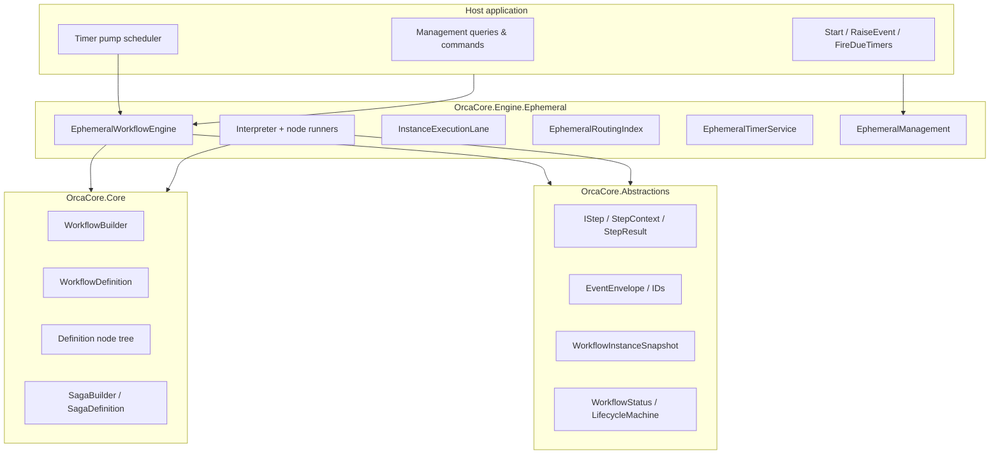

---

## 2. Engine composition (class diagram)

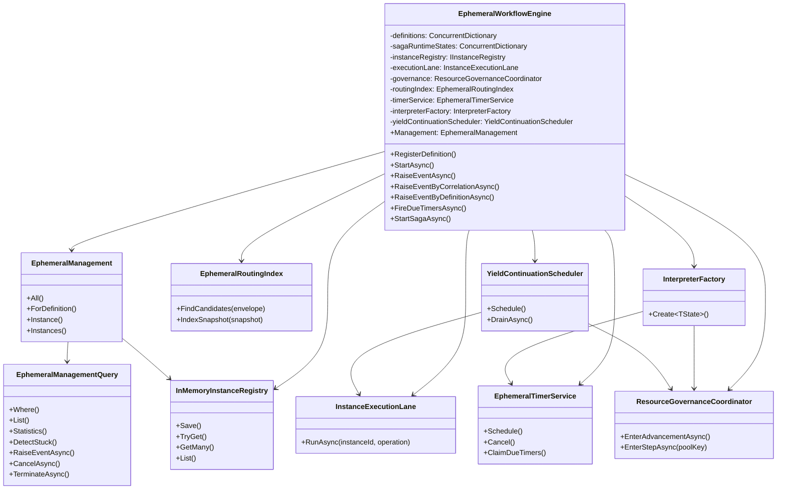

---

## 3. Interpreter and execution pipeline (class diagram)

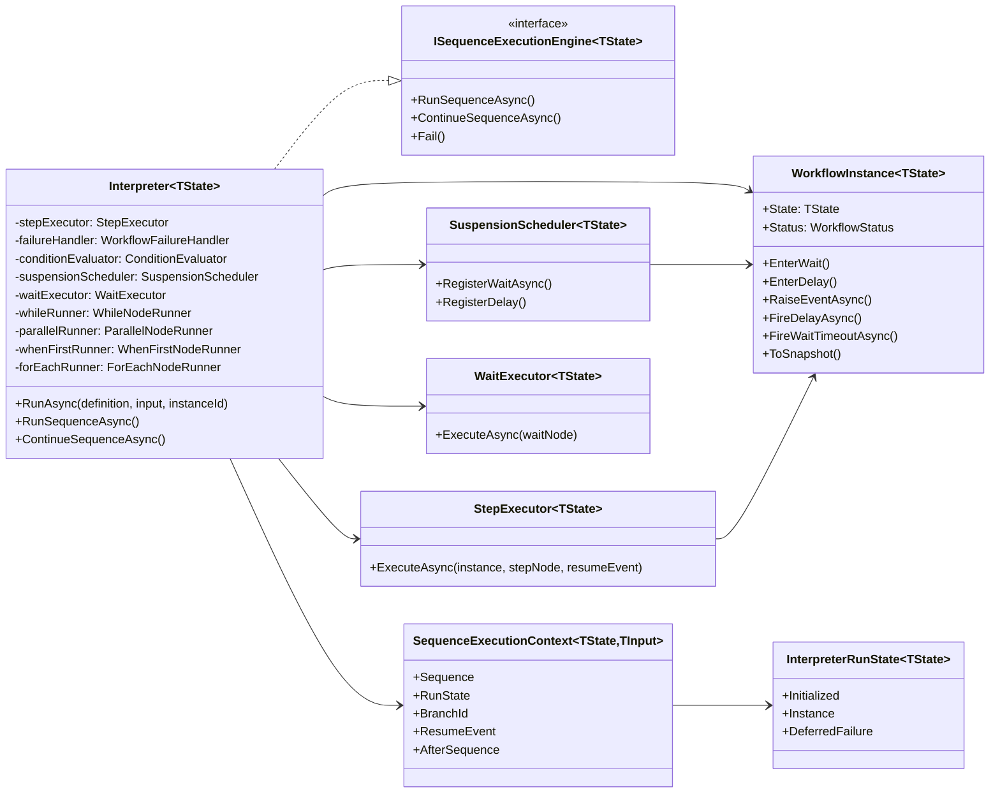

---

## 4. Workflow instance — in-memory state (class diagram)

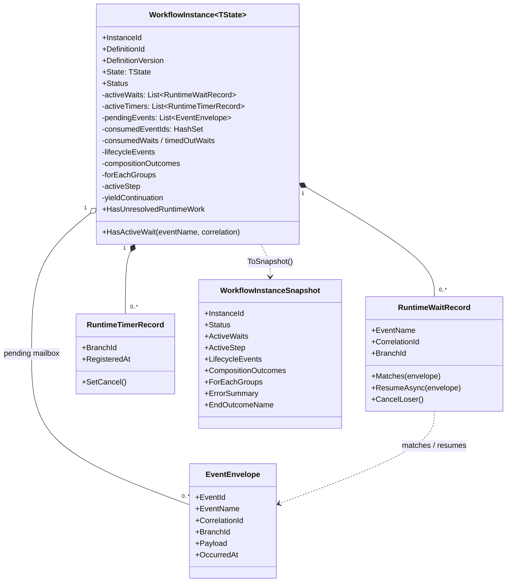

---

## 5. Definition model (class diagram)

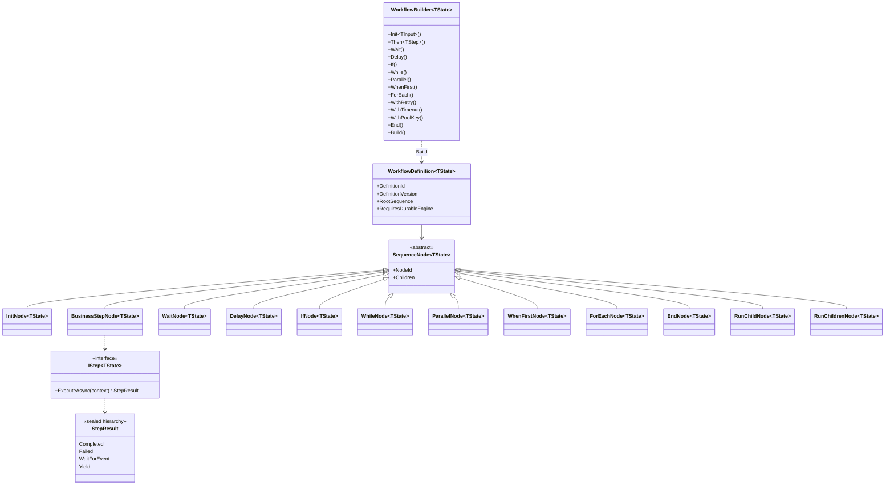

---

## 6. Concurrency and serialization model

Every instance is advanced through a **per-instance execution lane**. Global
concurrency is bounded separately by **resource governance**.

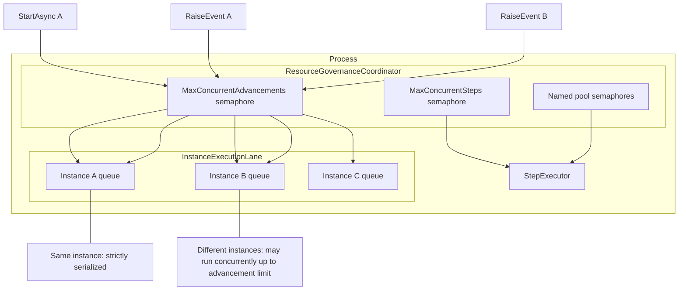

---

## 7. Lifecycle state machine

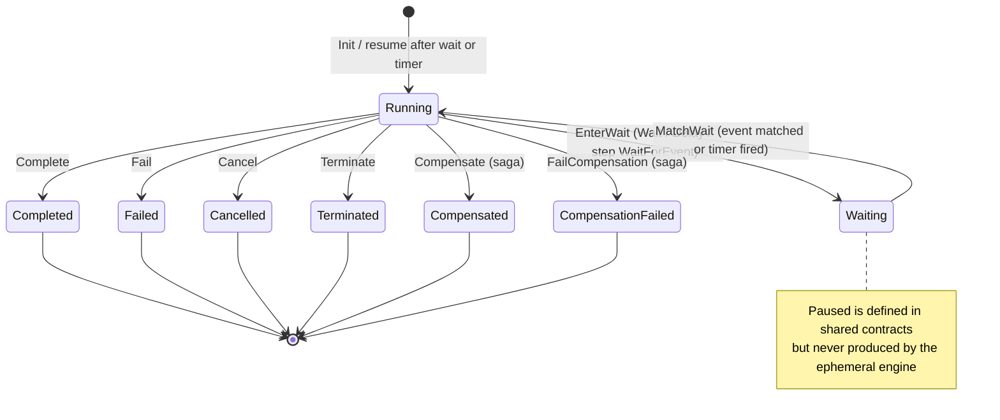

---

## 8. Start workflow (sequence)

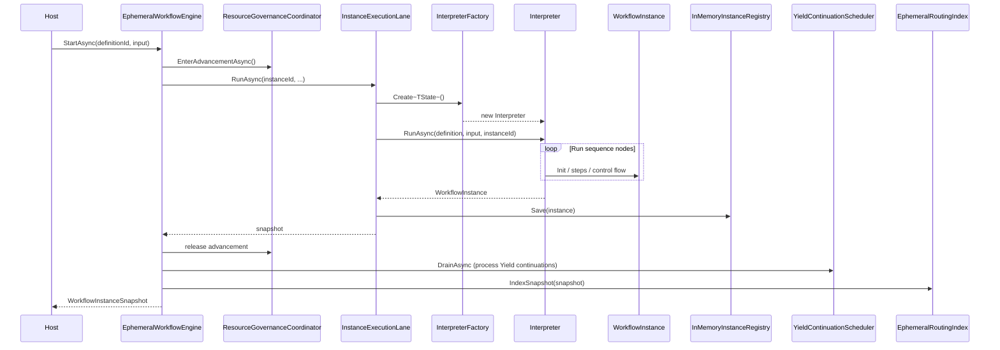

---

## 9. Raise event — instance targeted (sequence)

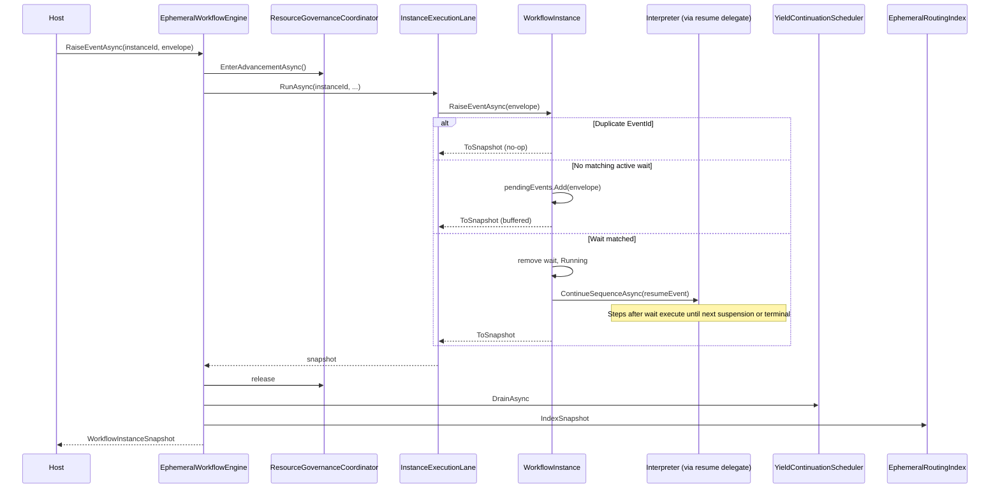

---

## 10. Correlation routing (sequence)

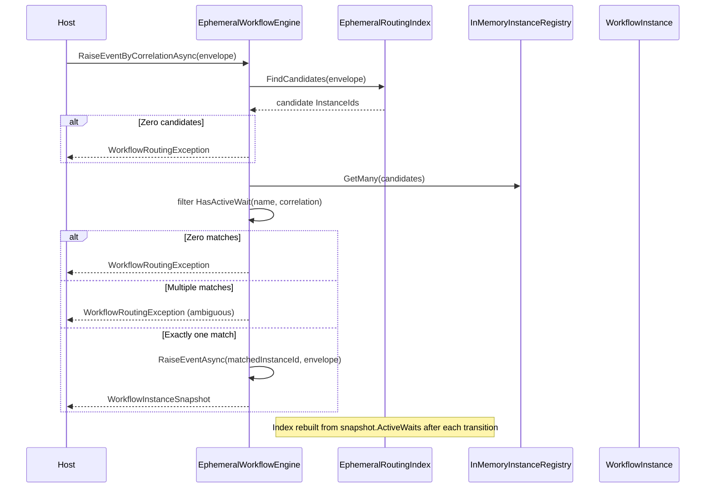

---

## 11. Wait registration and mailbox (flowchart)

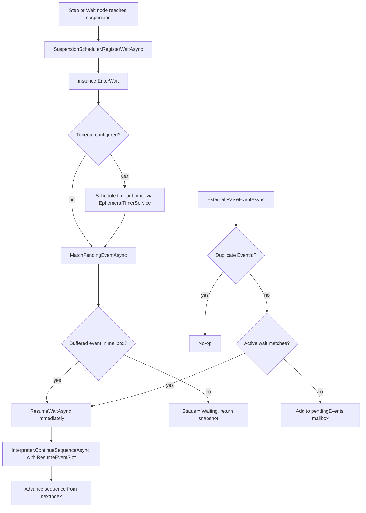

---

## 12. Timer pump (sequence)

Timers are **transient**. The host must call `FireDueTimersAsync`.

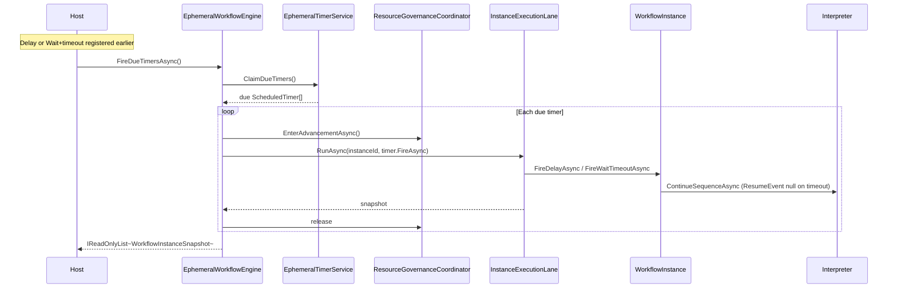

---

## 13. Yield cooperative scheduling (sequence)

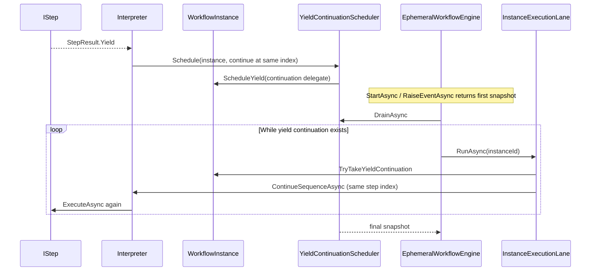

---

## 14. Control-flow node dispatch (flowchart)

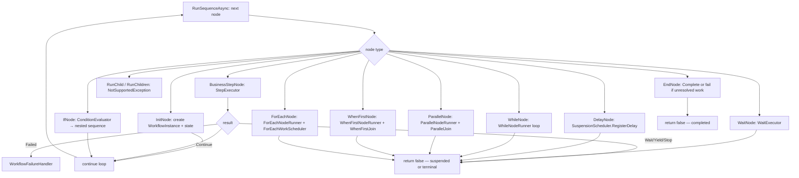

---

## 15. Parallel vs WhenFirst vs ForEach

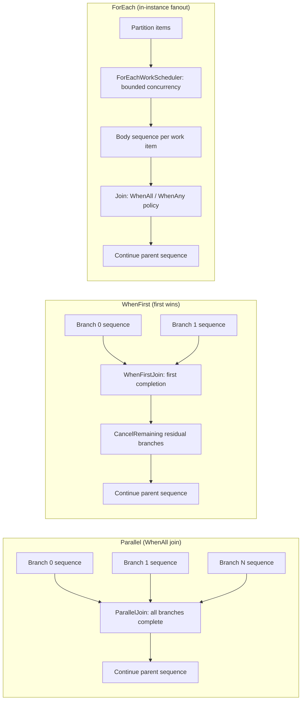

Branch-scoped waits and timers carry a `BranchId` so events resume only the
intended branch.

---

## 16. Ephemeral saga (reduced guarantee)

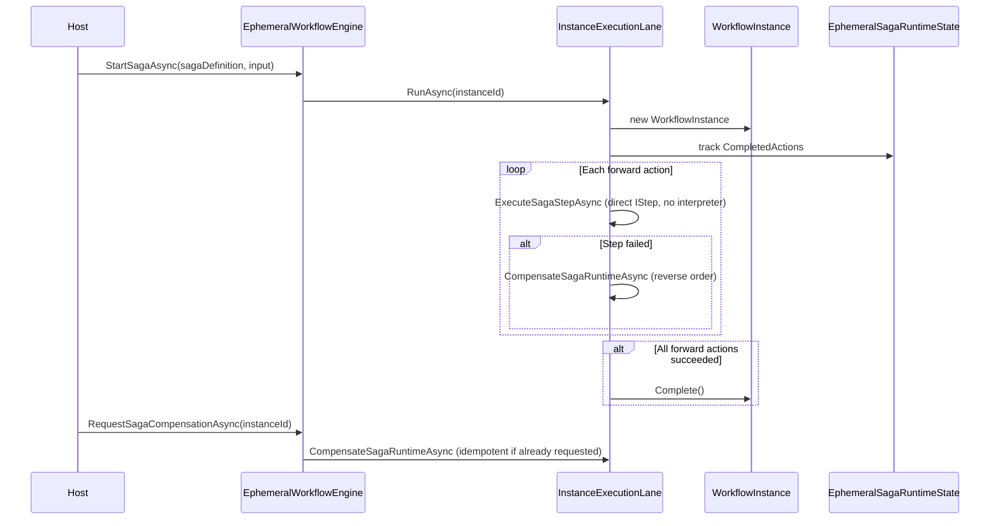

No durable audit, no restart recovery. Use durable saga mode for production
compensation history.

---

## 17. Management API surface

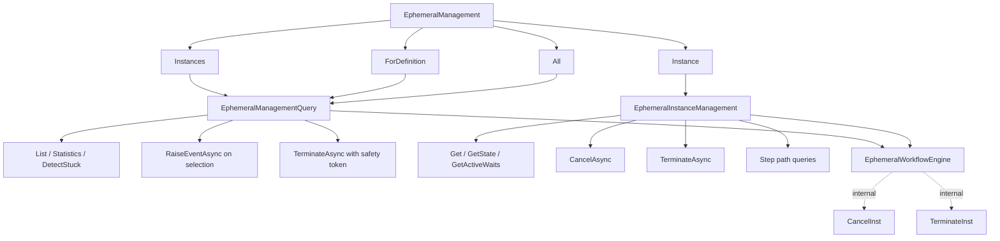

---

## 18. Event delivery modes (comparison)

| Mode | API | Resolution | Use when |
|------|-----|------------|----------|
| Instance-targeted | `RaiseEventAsync(instanceId, …)` | Direct lookup in registry | Caller stores `InstanceId` |
| Correlation-targeted | `RaiseEventByCorrelationAsync(…)` | `EphemeralRoutingIndex` → exactly one active wait | One wait per (eventName, correlation) |
| Definition fanout | `RaiseEventByDefinitionAsync(definitionId, …)` | Scan registry for matching waits | Broadcast to all instances of one definition |
| Selection fanout | `Management…RaiseEventAsync(…)` | Filter then instance-targeted per match | Operator / batch tooling |

---

## 19. What ephemeral mode does not do

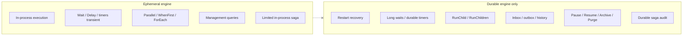

---

## How to read these alongside other docs

- Usage and API examples: [ephemeral-engine-developer-guide.md](ephemeral-engine-developer-guide.md)
- Legacy state-driven engine diagrams: [architecture/engine-runtime-diagrams.md](architecture/engine-runtime-diagrams.md)
- Ephemeral vs durable orchestration split: [architecture/child-workflow-orchestration-design-v3.md](architecture/child-workflow-orchestration-design-v3.md)
- Implementation phase tasks: [implementation/phases/phase-1-ephemeral-core/README.md](implementation/phases/phase-1-ephemeral-core/README.md)
