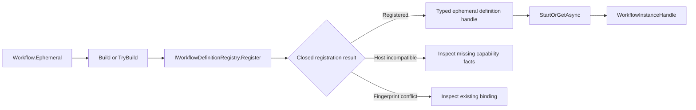
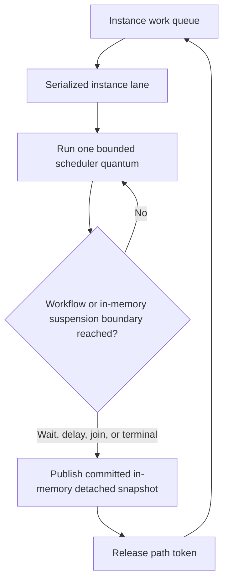
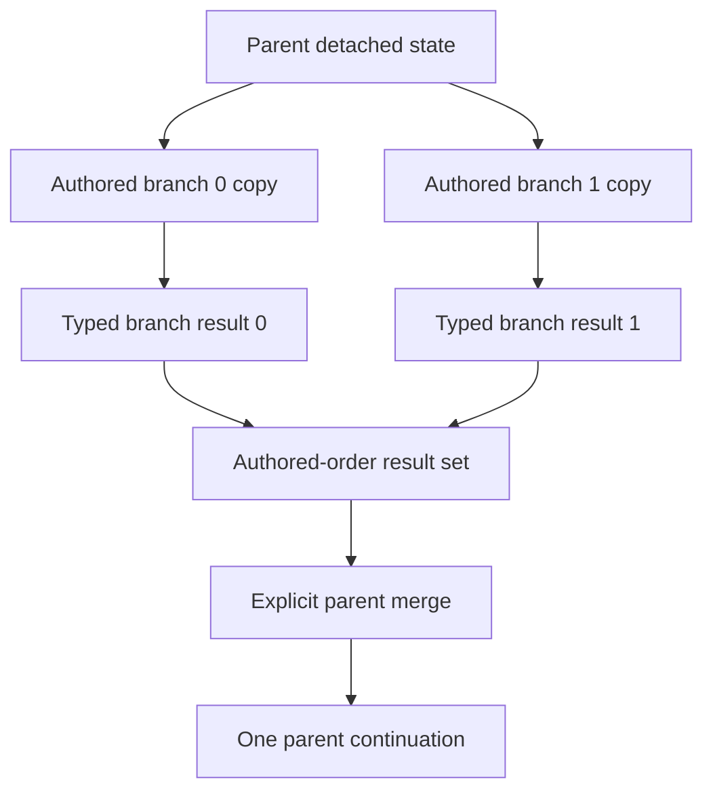
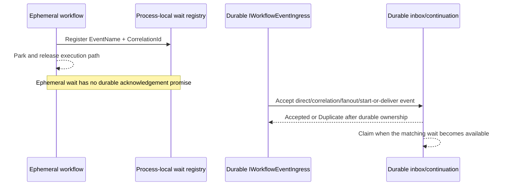
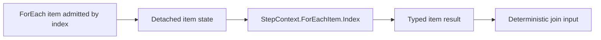

# OrcaCore Ephemeral Engine Runtime Diagrams

These diagrams show the selected v1 flow at application-contract level. Internal scheduling and
compiler types are intentionally omitted. See the
[ephemeral engine developer guide](ephemeral-engine-developer-guide.md) and the
[selected-mode capability matrix](specs/17-selected-mode-capability-matrix.md) for exact semantics.

## Author, register, and start

## One serialized instance lane

The ephemeral engine keeps one mutation lane per instance. Structured branch and item work may be
interleaved cooperatively, but user step bodies for one instance do not execute concurrently.

## Fixed fan-out and merge

Branches cannot mutate the parent or one another. Failure, cancellation, or deadline termination
suppresses the merge.

## Wait and durable ingress boundary

## Item context

Outside an admitted item body, `StepContext.ForEachItem` is `null`.

The superseded pre-v1 diagrams are preserved, unchanged, at
[`archive/plans/ephemeral-engine-diagrams.md`](archive/plans/ephemeral-engine-diagrams.md).
